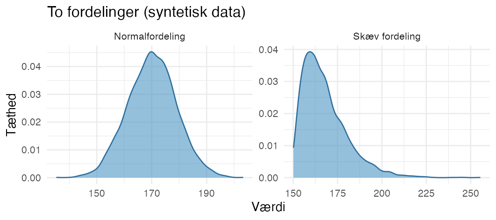
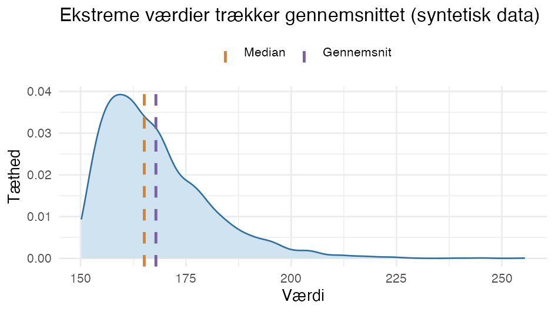

::: {.callout-warning}
**Under udvikling - mangler yderligere gennemgang.** Brug siden som en hurtig pejling, ikke som facit: tjek altid antagelserne og din analyseplan, og slå efter ved tvivl. En interaktiv "vælg dig igennem"-version er på vej.
:::

**Start med dit spørgsmål.** Formulér først dit forskningsspørgsmål og din **nulhypotese** - de styrer resten.

::: {.callout-note}
I R-kommandoerne i tabellerne er `x`, `y`, `gruppe`, `m0` osv. **pladsholdere** - erstat dem med dine egne variabel- og værdinavne. Kommandoer skrevet som `pakke::funktion` (fx `survival::coxph`, `epitools::riskratio`) kommer fra en **pakke**, der skal være installeret på DST; resten er base R (pakken `stats`, altid tilgængelig). Regression og time-to-event uddybes i [Regression](13d_regression.qmd) og [Time-to-event](13e_time-to-event.qmd).
:::

::: {.callout-tip}
**Foretrækker du et flowchart?** Antoine Soeteweys [beslutningstræ for valg af statistisk test](https://statsandr.com/blog/what-statistical-test-should-i-do/) er et glimrende visuelt alternativ til tabellerne her - du klikker dig gennem datatype, antal grupper, parret/uparret og fordeling.
:::

---

**Find den rette test - tre spørgsmål:**

1. **Hvilken datatype har dit udfald?** Numerisk (et tal), binær (ja/nej) eller time-to-event (tid indtil en hændelse). Det vælger **fanen** nedenfor.
2. **Er dine data parrede eller uparrede?** Samme person målt flere gange eller i 1:1-matchede par = parret; ellers uparret. Det vælger **rækken** i tabellen.
3. **Er antagelserne for en parametrisk test opfyldt?** Er de det, så brug den parametriske; ellers den nonparametriske pendant. Det vælger mellem de to **rækker** i hvert felt.

Er begreberne nye, så fold dem ud under [Begreber kort](#begreber-kort-klik-for-forklaring) nederst.

::: {.panel-tabset}

## Numerisk / kontinuert data

<table class="table">
<thead>
<tr><th>Analysetype</th><th>Parret?</th><th>Formål</th><th>Parametrisk?</th><th>Test</th><th>Antagelser</th><th>R</th></tr>
</thead>
<tbody>
<tr>
<td rowspan="2">Gennemsnit, én gruppe</td>
<td rowspan="2">Irrelevant</td>
<td rowspan="2">Sammenlign én gruppe med en hypotetisk værdi</td>
<td>Parametrisk</td><td>One-sample t-test</td><td>Normalfordeling; uafhængige</td><td><code>t.test(x, mu = m0)</code></td>
</tr>
<tr>
<td>Nonparametrisk</td><td>Wilcoxon signed-rank</td><td>Symmetrisk fordeling om medianen; uafhængige</td><td><code>wilcox.test(x, mu = m0)</code></td>
</tr>
<tr>
<td rowspan="4">Gennemsnit, to grupper</td>
<td rowspan="2">Uparret</td>
<td rowspan="2">Sammenlign to uparrede grupper</td>
<td>Parametrisk</td><td>Uparret t-test</td><td>Normal i begge; (ens varians); uafhængige</td><td><code>t.test(y ~ gruppe)</code></td>
</tr>
<tr>
<td>Nonparametrisk</td><td>Mann-Whitney (ranksum)</td><td>Uafhængige; samme fordelingsform</td><td><code>wilcox.test(y ~ gruppe)</code></td>
</tr>
<tr>
<td rowspan="2">Parret</td>
<td rowspan="2">Sammenlign to parrede grupper</td>
<td>Parametrisk</td><td>Parret t-test</td><td>Normalfordelte parvise forskelle</td><td><code>t.test(x1, x2, paired = TRUE)</code></td>
</tr>
<tr>
<td>Nonparametrisk</td><td>Wilcoxon signed-rank</td><td>Symmetriske parvise forskelle; uafhængige</td><td><code>wilcox.test(x1, x2, paired = TRUE)</code></td>
</tr>
<tr>
<td>Regression</td>
<td>Uparret</td>
<td>Generel lineær model for gennemsnittet</td>
<td>Parametrisk</td><td>Lineær regression</td><td>Normalfordeling; uafhængige</td><td><code>lm(y ~ x)</code></td>
</tr>
<tr>
<td rowspan="2">Gennemsnit, flere grupper</td>
<td rowspan="2">Uparret</td>
<td rowspan="2">Sammenlign flere gennemsnit</td>
<td>Parametrisk</td><td>One-way ANOVA</td><td>Normalfordeling; uafhængige</td><td><code>aov(y ~ gruppe)</code></td>
</tr>
<tr>
<td>Nonparametrisk</td><td>Kruskal-Wallis</td><td>Uafhængige; samme fordelingsform</td><td><code>kruskal.test(y ~ gruppe)</code></td>
</tr>
<tr>
<td rowspan="2">Sammenhæng (korrelation)</td>
<td rowspan="2">Irrelevant</td>
<td rowspan="2">Beskriv sammenhængen mellem to kontinuerte variable</td>
<td>Parametrisk</td><td>Pearsons korrelation</td><td>Lineær sammenhæng; normalfordelte; uafhængige</td><td><code>cor.test(x, y)</code></td>
</tr>
<tr>
<td>Nonparametrisk</td><td>Spearmans rangkorrelation</td><td>Monoton sammenhæng; uafhængige</td><td><code>cor.test(x, y, method = "spearman")</code></td>
</tr>
</tbody>
</table>

## Binær / dikotom data

<table class="table">
<thead>
<tr><th>Analysetype</th><th>Parret?</th><th>Formål</th><th>Parametrisk?</th><th>Test</th><th>Antagelser</th><th>R</th></tr>
</thead>
<tbody>
<tr>
<td>Andel, én gruppe</td>
<td>Irrelevant</td>
<td>Sammenlign én gruppe med en hypotetisk værdi</td>
<td>Parametrisk*</td><td>Binomialtest</td><td>Binomialfordeling; uafhængige</td><td><code>binom.test(x, n, p = p0)</code> (eksakt); <code>prop.test(x, n, p = p0)</code> (approks.)</td>
</tr>
<tr>
<td rowspan="2">Andel, to grupper</td>
<td>Uparret</td>
<td>Sammenlign to uparrede grupper</td>
<td>Parametrisk*</td><td>Chi-i-anden / Fishers eksakte</td><td>Uafhængige (Fisher ved små tal)</td><td><code>chisq.test(tabel)</code>; <code>fisher.test(tabel)</code></td>
</tr>
<tr>
<td>Parret</td>
<td>Sammenlign to parrede grupper</td>
<td>Parametrisk*</td><td>McNemar</td><td>Parrede obs.; uafhængige par</td><td><code>mcnemar.test(tabel)</code></td>
</tr>
<tr>
<td>Regression</td>
<td>Uparret</td>
<td>Binær regression for relativ risiko</td>
<td>Parametrisk</td><td>Log-binomial regression</td><td>Binomial; sandsynlighed modelleret af kovariater</td><td><code>glm(y ~ x, family = binomial(link = "log"))</code></td>
</tr>
</tbody>
</table>

\* *Chi-i-anden, Fishers eksakte, McNemar og binomialtesten kaldes i mange lærebøger **nonparametriske** (de antager ingen normalfordeling). Her følges **Parners** opdeling, hvor "parametrisk" betyder, at testen antager en bestemt fordeling - for disse tests **binomialfordelingen**.*

*Et effektmål med konfidensinterval på to grupper (risikoforskel, RR, OR) er et beskrivende mål, ikke en hypotesetest - beregn det fx med `epitools::riskratio()` eller `epitools::oddsratio()`.*

*Log-binomial regression i tabellen = en `glm` med log-link, der estimerer **relativ risiko** (RR) i stedet for odds ratio.*

## Time to event

<table class="table">
<thead>
<tr><th>Analysetype</th><th>Parret?</th><th>Formål</th><th>Parametrisk?</th><th>Test</th><th>Antagelser</th><th>R</th></tr>
</thead>
<tbody>
<tr>
<td>Kumulativ risiko</td>
<td>Irrelevant</td>
<td>Estimér den kumulative risiko / sammenlign grupper</td>
<td>Nonparametrisk</td><td>Kaplan-Meier + log-rank</td><td>Uafhængige; uafhængig højrecensurering</td><td><code>survival::survfit(Surv(tid, event) ~ gruppe)</code>; <code>survival::survdiff(Surv(tid, event) ~ gruppe)</code></td>
</tr>
<tr>
<td>Rate / hazard ratio</td>
<td>Uparret</td>
<td>Sammenlign rater</td>
<td>Semi-parametrisk</td><td>Cox-regression</td><td>Uafhængige; uafhængig højrecensurering; proportionale hazards</td><td><code>survival::coxph(Surv(tid, event) ~ x)</code>; PH-tjek: <code>survival::cox.zph()</code></td>
</tr>
</tbody>
</table>

:::

::: {.callout-tip}
**Vil du regne på rater pr. person-år?** Sammenligner du **incidensrater** opdelt på fx aldersgrupper eller kalenderperioder (i stedet for tid-til-første-hændelse), så bruger du **Poisson-regression**, der giver en **incidensrate-ratio (IRR)**. Se [Rater og rate-ratio (Poisson)](13f_rater-poisson.qmd) for hvornår du vælger den frem for Cox.
:::

---

## Begreber kort (klik for forklaring)

Mangler du de statistiske begreber? Fold ud for dem, tabellerne bygger på.

Hvilken datatype har mit udfald?

Datatypen afgør, hvilken tabel du skal bruge:

- **Numerisk (kontinuert):** et tal, fx alder, BMI eller blodtryk.
- **Binær (dikotom):** ja/nej, fx om en person fik en diagnose eller ej.
- **Time-to-event:** *tiden* indtil en hændelse sker, hvor ikke alle når hændelsen i opfølgningen (censurering) - fx tid til diagnose eller død.

Hvad er en normalfordeling?

En **normalfordeling** har en klokkeform: de fleste værdier ligger i midten, med få meget små og meget store. En **skæv** (eller uregelmæssig) fordeling gør ikke - den kan fx have en lang hale til den ene side.

De fleste **parametriske** tests (fx t-test) antager, at data er nogenlunde normalfordelte; er de tydeligt skæve, peger det mod en **nonparametrisk** test. Tjek formen med et histogram (`hist()`) eller et Q-Q-plot (`qqnorm()` + `qqline()`).

Gennemsnit eller median?

**Gennemsnittet** kan trækkes af ekstreme værdier (outliers), mens **medianen** (den midterste værdi) er mere robust. I en højreskæv fordeling ligger gennemsnittet derfor til højre for medianen:

Parametriske tests regner typisk på **gennemsnit**; nonparametriske tests bruger **rang/median** og er derfor mindre følsomme over for outliers og skæve fordelinger.

Afhængig vs. uafhængig variabel

- En **afhængig variabel** er dit **udfald** - det resultat, du undersøger (fx vægttab).
- En **uafhængig variabel** er noget, du har målt, som måske påvirker udfaldet (fx behandling, køn, alder). I et studie med to diæter er vægttabet den afhængige variabel, og diæten en uafhængig variabel.

(Forveksl ikke "uafhængig variabel" med "uafhængige data" - se næste boks.)

Parret eller uparret data

- **Uparrede eller uafhængige data:** forskellige, urelaterede personer i hver gruppe (fx én gruppe får diæt 1, en anden diæt 2). At man også registrerer fx køn på hver person gør det ikke til parrede data - køn og udfald er bare to forskellige variable.
- **Parrede/afhængige data:** den **samme** enhed måles mere end én gang (fx vægt før og efter en behandling) eller indgår i 1:1-matchede par. Det afgør, om du skal bruge en parret eller uparret test (se tabellerne).

Parret og matched er ikke det samme

Et **1:1-matchet par** (én case + én matchet kontrol) svarer til parrede data og analyseres parret. Men matcher du med **flere kontroller** (fx 1:5 case-control) eller har en **matchet kohorte**, er der matchsæt med mere end to i hver - en parret test kræver par og passer derfor ikke. De analyseres i stedet med **betinget logistisk regression** (`clogit` + `strata()`, se [Regression](13d_regression.qmd)) eller **stratificeret/klynget Cox** (se [Time-to-event](13e_time-to-event.qmd)), som generaliserer paret-idéen til matchsæt af enhver størrelse.

Parametrisk eller nonparametrisk

En *parametrisk* test eller model antager en bestemt fordeling - typisk normalfordeling for tests på tal, eller binomialfordelingen for tests på andele. En *nonparametrisk* test antager ingen bestemt fordeling og bygger i stedet på **rangordning** af værdierne (fx Wilcoxon); den er mere robust over for skæve fordelinger og outliers, men har som regel lidt mindre styrke (power). Tommelfingerregel: holder den parametriske tests antagelser (se [Antagelser](#antagelser-detaljer) nederst), så brug den; ellers den nonparametriske. (Cox kaldes *semi-parametrisk*: den antager ingen bestemt fordeling for overlevelsestiden, men en fast struktur for, hvordan covariater påvirker risikoen.)

Nonparametrisk "tvilling" til hver t-test

Hver t-test har en nonparametrisk pendant, der bruges, når normalantagelsen ikke holder:

- **One-sample t-test** → **one-sample Wilcoxon signed-rank** (tester medianen mod en værdi)
- **Uparret t-test** → **Mann-Whitney U** (= Wilcoxon **rank-sum**; to uafhængige grupper)
- **Parret t-test** → **Wilcoxon signed-rank** (parrede målinger)

Pas på navnene: **Mann-Whitney U** kaldes også Wilcoxon **rank-sum** - det er ikke det samme som Wilcoxon **signed-rank** (den parrede/one-sample). I R er de begge dog `wilcox.test()`; forskellen er `paired =` og om du giver to grupper eller to målinger.

## Antagelser

**Antagelser bag testene** - klik for detaljer

Hver test bygger på nogle antagelser. Nogle kan du **teste eller inspicere** i data; andre er **designspørgsmål**, du må vurdere ud fra, hvordan data er indsamlet. Her er dem, der nævnes i tabellerne:

**Normalfordeling** (t-tests, lineær regression, ANOVA). At værdierne - eller for regression modellens *residualer* - er nogenlunde normalfordelte. *Tjek:* visuelt med histogram (`hist()`) og Q-Q-plot (`qqnorm()` + `qqline()`); evt. en formel test (`shapiro.test()`), men den er overfølsom ved store stikprøver, så stol mest på det visuelle. Ved store stikprøver er t-test og gennemsnit desuden robuste (den centrale grænseværdisætning).

**Normalfordelte parvise forskelle** (parret t-test). Det er *forskellene* (fx før minus efter), der skal være ca. normalfordelte - ikke hver gruppe for sig. *Tjek:* histogram/Q-Q-plot af forskellene.

**Symmetrisk fordeling** (Wilcoxon signed-rank). Testen antager, at fordelingen af værdierne (om medianen) eller af de parvise forskelle er **symmetrisk** - ikke nødvendigvis normal. *Tjek:* histogram af værdierne/forskellene; er fordelingen tydeligt skæv, kan en sign-test være mere passende.

**Ens varians (homoskedasticitet)** (uparret t-test, ANOVA, lineær regression). Grupperne (eller residualerne) har nogenlunde samme spredning. *Tjek:* boxplot per gruppe; `var.test()` (to grupper) eller `car::leveneTest()` (flere grupper); for regression residual-plot via `plot(model)`. Bemærk: Welchs t-test (R's standard) antager *ikke* ens varians, så her er det sjældent et problem.

**Uafhængige observationer** (næsten alle tests). Hver observation bidrager med uafhængig information - fx ikke flere rækker fra samme person eller andre klynger. *Kan ikke testes i data* - det er et design-/datastrukturspørgsmål. *Inspicér:* har du gentagne rækker per person, matchede par eller klynger? Så brug en metode, der tager højde for det (parret test, klyngebaserede standardfejl - se [Regression](13d_regression.qmd#klyngebaserede-standardfejl) - eller en mixed model).

**Samme fordelingsform** (nonparametriske tests: Wilcoxon, Mann-Whitney, Kruskal-Wallis). For at sammenligningen er meningsfuld, bør grupperne have nogenlunde samme fordelingsform. *Tjek:* sammenlign tæthedskurver/histogrammer eller boxplots per gruppe (svært at teste formelt, så inspicér visuelt).

**Binomialfordeling** (binomialtest). Et ja/nej-udfald talt op over uafhængige enheder med samme sandsynlighed. *Mest et designspørgsmål* - vurdér, om data passer til det (uafhængige personer, samme udfaldsdefinition).

**Tilstrækkelige forventede celletal** (chi-i-anden). Testen er upålidelig, hvis de *forventede* tal i cellerne er for små (tommelfingerregel: under 5). *Tjek:* se de forventede tal med `chisq.test(tabel)$expected`; er nogle små, så brug `fisher.test()` i stedet.

**Uafhængige par** (McNemar). Parrene er matchede, og selve parrene er uafhængige af hinanden. *Designspørgsmål* - følger af, hvordan du har parret.

**Uafhængig (højre)censurering** (Kaplan-Meier, log-rank, Cox). At dem, der censureres (fx mistes til opfølgning), ikke systematisk har højere eller lavere risiko end dem, der følges videre. *Kan ikke testes direkte* - argumentér ud fra, hvorfor folk censureres (administrativt opfølgningsstop = typisk uafhængigt; tab til opfølgning knyttet til helbred = problematisk). Evt. følsomhedsanalyser.

**Proportionale hazards** (Cox-regression). At en variabels effekt (hazard ratio) er nogenlunde konstant over tid. *Tjek:* `survival::cox.zph()` (Schoenfeld-residualer) og log-log-overlevelseskurver - se [Time-to-event](13e_time-to-event.qmd).

::: {.callout-note}
Husk: alt der forlader DST skal gennem **outputkontrol** - ingen små celler, kun aggregerede resultater. Se [Fase 14 - Eksport og hjemsendelse](14_eksport-hjemsendelse.qmd).
:::

---

*Oversigten er lavet ud fra noter fra [Erik Parners](https://pure.au.dk/portal/da/persons/parner@ph.au.dk/) statistik-kurser på Aarhus Universitet - kurser jeg varmt kan anbefale.*

::: {.callout-tip}
## Læs mere

Generel uddybning i *The Epidemiologist R Handbook* (på engelsk):

- [Simple statistical tests](https://www.epirhandbook.com/en/new_pages/stat_tests.html)

Mangler du det statistiske grundlag (hvad en test, p-værdi eller et konfidensinterval egentlig betyder)? Se [*Learning Statistics with R* (Navarro)](https://learningstatisticswithr.com/) - en begyndervenlig gennemgang af teorien bag.
:::
