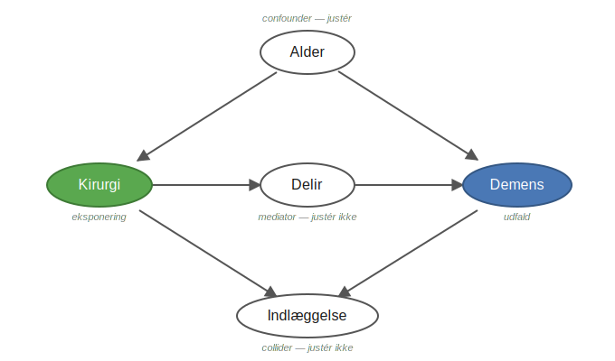

Registerforskning starter ikke i R. Det starter med blyant og papir.
Denne side guider dig igennem de ting, du bør have på plads, inden du skriver en eneste linje kode.

::: {.callout-tip}
**Kort fortalt:** Læg fire ting fast på papir, før du koder — et præcist forskningsspørgsmål, din datamodel (hvilke registre dækker eksponering, udfald og kovariater), dine kovariater valgt med en DAG, og din sammenligningskohorte.
:::

---

## Nøglebegreber

Inden du planlægger et studie er det værd at kende disse termer — de bruges igennem hele guiden.

**Kohorte**
En gruppe af personer der følges over tid, fordi de deler en bestemt karakteristik på et bestemt tidspunkt.
Eksempel: alle patienter der fik bariatrisk kirurgi i perioden 2010–2020.

**Index-dato**
Startdatoen for opfølgningen — det tidspunkt fra hvilket du begynder at tælle.
For opererede patienter er det typisk operationsdatoen. For matchede kontroller tildeles den samme dato som den matchede opererede patient.

**Eksponering**
Den faktor du undersøger effekten af — fx en operation, et lægemiddel eller en diagnose.

**Udfald**
Det du måler — fx debut af en sygdom, en indlæggelse, eller død.

**Kovariater**
Variable du inkluderer for at tage højde for bl.a. confounding — faktorer der påvirker både eksponering og udfald.
Eksempler: alder, køn, komorbiditet, socioøkonomisk status.

---

## 1. Hvad vil jeg undersøge?

Formulér dit forskningsspørgsmål præcist, inden du begynder at kigge på data.
Et vagt spørgsmål giver et rodet datasæt. Et præcist spørgsmål giver en klar plan.

Stil dig selv disse spørgsmål:

| Spørgsmål | Eksempel |
|---|---|
| Hvem er min population? | Alle voksne med T2D i Danmark, 2010–2020 |
| Hvad er min eksponering? | Bariatrisk kirurgi |
| Hvad er mit udfald? | Demens |
| Hvornår starter opfølgningen? | Operationsdato (index-dato) |
| Hvornår stopper den? | Diagnose, død, emigration eller studieperiode slut |
| Hvilke confoundere skal justeres for? | Alder, køn, komorbiditet, SES |

---

## 2. Hvilke registre dækker hvad?

Inden du kortlægger din datamodel er det nyttigt at vide hvilke registre der eksisterer.

| Hvad skal du finde? | Register |
|---|---|
| Demografi (alder, køn, bopæl) | BEF — Befolkningsregistret |
| Hospitalsdiagnoser og -kontakter | LPR — Landspatientregistret (LPR2 + LPR3) |
| Receptordinerede lægemidler | LMDB — Lægemiddelstatistikregistret |
| Dødsdato (til censurering) | DODSAARS — Dødsregistret |
| Emigration (til censurering) | VNDS — Migrationsregistret |
| Uddannelse | UDDA — Uddannelsesregistret |
| Indkomst | FAIK — Familieindkomstregistret |
| Beskæftigelse | AKM — Arbejdsklassifikationsmodulet |

En komplet beskrivelse af alle registre med kolonnenavne og join-nøgler finder du i [Fase 15 — Registerreference →](15d_register_reference.qmd)

---

## 3. Vælg dine kovariater med en DAG

Hvilke variable skal du justere for? Det er ikke "så mange som muligt". At justere for de forkerte variable kan **indføre** bias i stedet for at fjerne den.

Et **DAG** (directed acyclic graph — et kausalt diagram) er en tegning af dine antagelser om, hvordan eksponering, udfald og øvrige variable hænger sammen. Det gør dine antagelser eksplicitte og hjælper dig med at vælge det rigtige sæt kovariater.

Tommelfingerregler:

- **Justér for confoundere** — variable der påvirker både eksponering og udfald (fx alder, comorbiditet).
- **Justér IKKE for mediatorer** — variable der ligger *på* årsagsvejen mellem eksponering og udfald (det fjerner en del af den effekt du vil måle).
- **Justér IKKE for colliders** — fælles effekter af to variable (det åbner en falsk sammenhæng).

<details>
<summary>Eksempel: kirurgi og demens — en DAG med confounder, mediator og collider</summary>

Et konkret eksempel: påvirker **kirurgi** risikoen for **demens**?

{#fig-dag fig-alt="Kausalt diagram med fem variable: kirurgi (eksponering), demens (udfald), alder (confounder), delir (mediator) og indlæggelse (collider)." width="92%"}

- **Alder** er en *confounder* — den påvirker både sandsynligheden for kirurgi og for demens. **Justér for den.**
- **Delir** (postoperativt delirium) er en *mediator* — den ligger på vejen kirurgi → delir → demens. **Justér ikke** — så fjerner du en del af den effekt du vil måle.
- **Indlæggelse** er en *collider* — både kirurgi og demens fører til indlæggelse. **Justér ikke** — det åbner en falsk sammenhæng.

Du kan indsætte modellen direkte i [dagitty.net](https://dagitty.net/dags.html) og få det minimale justeringssæt udregnet:

```
dag {
  Alder        [pos="0,-1"]
  Kirurgi      [exposure, pos="-1.5,0"]
  Delir        [pos="0,0"]
  Demens       [outcome,  pos="1.5,0"]
  Indlaeggelse [pos="0,1"]
  Alder   -> Kirurgi
  Alder   -> Demens
  Kirurgi -> Delir
  Delir   -> Demens
  Kirurgi -> Indlaeggelse
  Demens  -> Indlaeggelse
}
```

For denne DAG er det minimale justeringssæt **{Alder}** — du skal kun justere for alder.

</details>

::: {.callout-tip}
**Værktøjer**

- [dagitty.net](https://dagitty.net/) — tegn dit diagram i browseren; det udregner automatisk det minimale sæt af kovariater du skal justere for.
- [Causal Diagrams: Draw Your Assumptions Before Your Conclusions](https://pll.harvard.edu/course/causal-diagrams-draw-your-assumptions-your-conclusions) — gratis HarvardX-kursus af Miguel Hernán om netop dette.
- Baggrund: [Hernán & Robins, *Causal Inference: What If*](https://miguelhernan.org/whatifbook) (gratis PDF) — også i [Fase 15 — Læringsressourcer](15e_laeringsressourcer.qmd).
:::

---

## 4. Sammenligningskohorten {#sammenligningskohorten-komparator}

Mange studier sammenligner en eksponeret gruppe med en **sammenligningskohorte**. Hvordan du bygger den, er en designbeslutning du skal tage på papir — inden koden.

Det skal du overveje:

- **Hvem er en passende sammenligningskohorte?** Fx for bariatrisk kirurgi: personer med svær overvægt der *ikke* blev opereret, eller en matchet baggrundsbefolkning. Valget afhænger af spørgsmålet.
- **Index-dato til sammenligningskohorten.** Din eksponerede kohorte har en index-dato der er bestemt af eksponeringen (fx operationsdatoen). Det har sammenligningskohorten ikke — den skal *tildeles* en dato, typisk den samme dato som den matchede eksponerede person, så begge grupper følges fra et sammenligneligt tidspunkt.
- **Eligibilitet ved index.** Sammenligningskohorten skal opfylde inklusionskriterierne på sin tildelte index-dato — ellers risikerer du *immortal time bias* (en skævvridning der opstår, når en person tildeles eksponeringstid, hvori de per definition ikke kunne have fået udfaldet endnu).
- **Matchingvariable og -ratio.** Fx alder, køn og kalenderår; beslut forholdet (fx 1:5).
- **Kan nogen i sammenligningskohorten blive eksponeret senere?** Fx: kan en person der startede som kontrol, få operationen på et tidspunkt? Beslut hvad der sker i det tilfælde — om de forbliver kontrol, eller overgår til den eksponerede gruppe.
- **Samme eksklusioner** anvendes på begge grupper.

→ Det komplette mønster for kohorteopbygning og matching finder du i [Fase 10 — Byg din studiepopulation](10_byg-din-kohorte.qmd).

---

## 5. Dan et overblik — pen og papir

Inden du åbner R, svar på disse spørgsmål skriftligt:

1. **Hvilke variable skal jeg bruge?** (patientinformation — alder, køn, diagnoser mv. - og for hvilke år)
2. **Hvilke registre indeholder disse oplysninger?** (LPR, BEF, LMDB, ...)
3. **I hvilken rækkefølge skal data samles?** (definer population → hent udfald → hent kovariater)

Et godt overblik på papiret sparer mange timers fejlretning i koden.

<details>
<summary>Eksempel: overblik for et demensstudie</summary>

```
Population:   Voksne der har fået bariatrisk kirurgi (identificeret via Databasen for Behandling af Svær Overvægt — DBSO), 2010–2024
              Matchede kontroller fra Befolkningsregistret (BEF)

Udfald:       Første demensdiagnose (LPR — ICD-10: F00–F03, G30–G31)
              Dato: første kontakt med demenskode efter operationsdato

Kovariater:   Alder og køn (BEF)
              Komorbiditet (LPR — 5-års lookback, dvs. diagnoser i de 5 år inden index-dato)
              Uddannelse (UDDA)
              Indkomst (FAIK via BEF familie_id)
              Beskæftigelse (AKM)

Censurering:  Død (DODSAARS)
              Emigration (VNDS)
              Studieperiode slut (31. dec 2024)
```

</details>

---

## 6. Lav en analyseplan

En analyseplan er et dokument, du skriver **inden** du ser på dine data.
Det tvinger dig til at tage stilling til design, statistik og variable, før resultaterne farver dine beslutninger.

**Brug STROBE-checklisten** som skelet:
[STROBE Statement — checklists →](https://www.strobe-statement.org/checklists/)

**Pre-registrer din analyseplan på fx OSF** — det er god videnskabelig praksis og kræves af mange tidsskrifter:
[Open Science Framework — registreringsskabeloner](https://help.osf.io/article/330-welcome-to-registrations)

---

## 7. Næste skridt

Når du har dit overblik på plads:

- **Ny R-bruger?** → [Fase 2 — R: det allermest nødvendige](02_r-intro.qmd)
- **Klar til DST-serveren?** → [Fase 3 — Log ind på DST](03_log-ind-dst.qmd)
- **Arbejder du på DARTER / projekt 708421?** → Læs dette inden du starter: [DARTER — oversigt og pipeline](darter/00_index.qmd)
