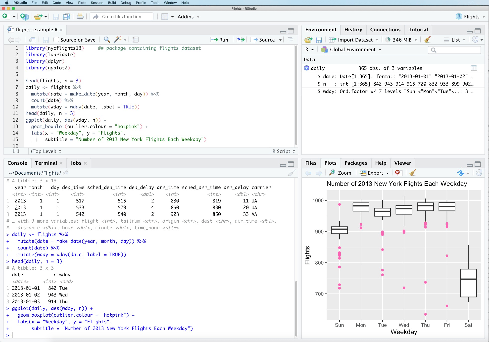

Du behøver ikke at lære R fra bunden.
Denne fase giver dig det minimum, du skal have, for ikke at føle dig fortabt, når du ser din første linje kode i Fase 6.
Datastrukturer og basiskommandoer til udforskende analyse kommer i Fase 7 og 11 - de giver ingen mening, før du har data at kigge på.

---

## Download R og RStudio

R og RStudio er allerede installeret på DST-serveren - du behøver ikke installere dem nu.
Men hvis du vil øve dig lokalt, inden du logger ind for første gang:

- **R:** [cran.r-project.org](https://cran.r-project.org/) - download den nyeste version til dit styresystem
- **RStudio:** [posit.co/download/rstudio-desktop](https://posit.co/download/rstudio-desktop/) - gratis desktop-version

### Læringsressourcer

Vil du lære R, epidemiologi eller statistik, finder du en kurateret liste over kurser, bøger og opslagsværker i [Læringsressourcer](laeringsressourcer.qmd).

**Hurtigt valg:** Start med [DDEA Introductory Course](https://r-cubed-intro.rostools.org/) hvis du er helt ny i R, eller [The Epidemiologist R Handbook](https://www.epirhandbook.com/en/) hvis du kender lidt R og vil direkte til sundhedsvidenskabelige anvendelser.

---

## RStudio første gang

RStudio er opdelt i fire paneler:

{fig-alt="RStudio-interface med fire paneler"}

*Kilde: [Wikipedia / RStudio](https://en.wikipedia.org/wiki/RStudio), CC BY-SA 4.0*

**Øverst til venstre - Script-editor**

Her skriver og gemmer du din kode. Du kan have flere scripts åbne på én gang og skifte mellem dem via fanerne øverst i panelet. Husk at gemme ændringer løbende - **Ctrl+S** (Windows) / **CMD+S** (Mac).

**Øverst til højre - Environment / History / Connections**

- **Environment:** viser alle objekter du har oprettet i den aktuelle R-session - data frames, vektorer, lister. Funktioner fra pakker (fx `filter()` fra dplyr) vises *ikke* her; kun det du selv har lavet.
- **History:** en log over alle kommandoer du har kørt i konsollen.
- **Connections:** bruges til databaseforbindelser og versionsstyringssystemer som GitHub. GitHub er et online system til at gemme og dele kode - men DST-serveren har ikke adgang til internettet, så du kan ikke synkronisere kode direkte derfra. Du behøver ikke lære GitHub for at arbejde på DST.

**Nederst til venstre - Konsol**

Her udføres kode og her vises output og fejlmeddelelser. Du kan skrive kommandoer direkte i konsollen - men de gemmes ikke. Alt arbejde du vil beholde, skal ligge i et script.

**Nederst til højre - Files / Plots / Packages / Help**

- **Files:** en filbrowser til dine mapper og filer på serveren.
- **Plots:** grafer du laver vises her - også selvom de ikke er gemt endnu.
- **Packages:** liste over alle installerede pakker. Flueben ud for en pakke betyder at den er indlæst med `library()` og klar til brug.
- **Help:** hjælpedokumentation. Åbnes automatisk når du skriver `?funktionsnavn` i konsollen - fx `?filter` åbner hjælpen for `filter()`.

::: {.callout-tip}
**Hvis et panel forsvinder:** gå til **View → Panes → Show All Panes** i menulinjen øverst. Du kan også klikke på ikonet med fire firkanter i menulinjen.
:::

**Kør kode:** placer cursoren på en linje og tryk **Ctrl+Enter**.

---

## Åbn et script, skriv én linje, kør den

**File → New File → R Script**

Skriv disse tre linjer og kør dem én ad gangen med Ctrl+Enter:

```r
x <- 5        # tildel værdien 5 til variablen x
x             # skriv variabelnavnet for at se indholdet
x * 2         # brug variablen i en beregning
```

Du har nu skrevet, kørt og brugt din første linje R-kode.

[]{#hvad-er-et-objekt}

**Hvad er et objekt?**

`x <- 5` *opretter et objekt*. Pilen `<-` betyder "gem det til højre under navnet til venstre". Fra nu af står `x` for værdien 5 - indtil du selv overskriver den. Mønstret er altid det samme:

```r
navn <- noget
```

Du *navngiver* noget, så du kan bruge det igen senere uden at skrive det forfra. Næsten alt i R er et objekt: et enkelt tal, en hel tabel, en model. Når du fx henter et register ind med `collect()`, gemmer du det typisk i et objekt, så du kan arbejde videre med det:

```r
bef_data <- bef %>% collect()   # gem den hentede tabel i objektet bef_data
```

Objekterne du opretter, kan du se i **Environment**-panelet øverst til højre i RStudio.

---

## Hvad er en funktion? En pakke? Hvad gør library()?

**En funktion** er en kommando der udfører en handling.
`filter(data, alder > 50)` er en funktion. `sum(c(1, 2, 3))` er en funktion.
Du genkender funktioner på parenteserne.

**Hvad er der i parenteserne?**
Parenteserne er der altid - men de er ikke altid fyldte. Det afhænger af om funktionen behøver input for at vide hvad den skal gøre:

- `filter(alder > 50)` - *kræver* at du fortæller den betingelsen; ellers ved den ikke hvad den skal filtrere på
- `open_dataset("E:/workdata/...")` - *kræver* stien; ellers ved den ikke hvad den skal åbne
- `collect()` - *kræver ingenting*; den ved allerede hvad den skal hente, fordi det er røret der har sendt data frem til den
- `ungroup()` - *kræver ingenting*; den fjerner bare grupperingen fra det der er sendt igennem røret

Tommelfingerregel: tomme parenteser betyder at funktionen virker på *det der er sendt videre med røret*, uden at du behøver fortælle den noget ekstra.

**En pakke** er en samling af funktioner skrevet af andre, som du kan hente ind.
R kommer med basisfunktioner, men det meste vi bruger er i pakker som `dplyr` og `arrow`.

**`library()`** indlæser en pakke, så dens funktioner er tilgængelige i din session.

```r
install.packages("dplyr")   # installer pakken én gang (eller efter server-nulstilling)
library(dplyr)               # indlæs pakken i starten af hver session
```

Du vil se `library(dplyr)` øverst i næsten alle scripts.

---

## 6 funktioner og symboler du møder igennem guiden

Du vil se disse i næsten alle udtræk. Du behøver ikke forstå dem i detaljer nu - bare genkende dem.

Et symbol du vil se overalt er **`%>%`** (røret). Det sender resultatet fra én linje videre som input til den næste. `df %>% filter(alder > 50)` betyder: "tag `df`, og giv det videre til `filter()`". Det gør det muligt at kæde trin sammen og læse kode oppefra og ned.

| Funktion | Hvad den gør | Eksempel |
|---|---|---|
| `filter()` | Behold rækker der opfylder et krav | `df %>% filter(alder > 50)` |
| `select()` | Vælg hvilke kolonner du vil beholde | `df %>% select(pnr, alder, koen)` |
| `collect()` | Hent parquet-data ind i R-hukommelsen | `register %>% filter(...) %>% collect()` |
| `mutate()` | Opret en ny kolonne eller ændr en eksisterende | `df %>% mutate(alder_kat = alder > 65)` |
| `left_join()` | Kobl to datasæt - behold alle rækker fra venstre | `kohort %>% left_join(bef, by = "pnr")` |
| `%>%` | Røret - sender resultatet videre til næste funktion | `df %>% filter(alder > 50) %>% select(pnr)` |

Røret `%>%` forklares grundigt i [Funktioner: oversigt](guide_til_funktioner.qmd#røret), og `collect()` i [Fase 5 - Udtræk trin for trin](05_udtraek-trin-for-trin.qmd).

---

## Når du sidder fast

Følg denne rækkefølge. AI er nederst af en god grund.

| # | Hvor | Hvornår |
|---|---|---|
| 1 | **Kollega eller vejleder** | Spørg først - de kender jeres data og workflow |
| 2 | **Google** | Søg på fejlbeskeden inklusiv `Error:` |
| 3 | **Stack Overflow** | Verdens største samling af kode-spørgsmål og -svar |
| 4 | **Zheers R Coding Café** | [r-coding-cafe.zheer.dk](https://r-coding-cafe.zheer.dk/) - registerdata-specifikt |
| 5 | **Officiel pakkdokumentation** | Søg pakkens navn + "documentation" |
| 6 | **AI (Claude, ChatGPT)** | God til kodeproblemer, men let at tro på forkerte svar - brug kun, når du forstår svaret |

::: {.callout-warning}
**Undgå AI som første stop, hvis du er ny.**
AI kan generere plausibel-lydende kode, der ikke virker - eller virker, men giver forkerte resultater.
Brug det som supplement til din egen forståelse, ikke som erstatning.
:::

<details>
<summary>Sådan bruger du AI bedst til R-kode</summary>

AI er god til at forklare fejlbeskeder og foreslå løsninger - men du skal give den nok kontekst, og du skal selv verificere svaret.

**Giv AI dette:**

1. **Den præcise fejlbesked** (inklusiv `Error:` og linjenummer hvis der er et)
2. **Den kode der fejler** - så lidt som muligt, men nok til at reproducere fejlen
3. **Hvad du forventede vs. hvad der skete**
4. **Hvilke pakker du bruger** (fx "dplyr og arrow på DST")

**Eksempel på et godt AI-spørgsmål:**
> "Jeg får `Error: Column 'pnr' not found` når jeg kører denne kode med dplyr og arrow på DST. Jeg bruger `load_database()` fra dstDataPrep. Hvad er galt?"
> ```r
> bef <- load_database("bef")
> bef %>% filter(pnr == "001")   # fejl her
> ```

**Bed om forklaring, ikke bare løsning:**
Skriv "forklar hvad der er galt og hvorfor" fremfor bare "fiks det". Hvis du kun får koden rettet uden at forstå hvorfor, vil den samme fejl dukke op igen næste gang.

**Bed AI spørge inden det svarer:**
Skriv "stil mig spørgsmål inden du svarer, hvis du mangler information". AI gætter ofte på kontekst den ikke har - det giver bedre svar hvis den spørger om fx din pakkeversion, registertype eller hvad du egentlig vil opnå.

**Verificer altid svaret:**
Kodeeksempler fra AI er udgangspunkter - ikke garantier. Tjek at kolonnenavne, funktionsnavne og logik passer til dine data med `names()`, `class()` og `head()`.

</details>

<details>
<summary>Sådan stiller du et godt hjælp-spørgsmål (minimalt reproducerbart eksempel)</summary>

Et godt hjælp-spørgsmål er **minimalt** (mindste kode der viser fejlen), **komplet** og **reproducerbart**.

**Dårligt:** "Min kode fejler, hvad er galt?" *(ingen kode, ingen fejlbesked)*

**Godt:**
> "Jeg får fejlen `Error: object 'pnr' not found` - hvad mangler?"
>
> ```r
> library(dplyr)
> df <- data.frame(PNR = 1:5, alder = 20:24)
> df %>% filter(pnr > 3)   # fejl her
> ```
>
> Forventet: rækker hvor PNR > 3. Faktisk: fejl om at 'pnr' ikke findes.

Fejlen: kolonnen hedder `PNR`, koden spørger efter `pnr`. R skelner mellem store og små bogstaver.

</details>

---

## Tastaturgenveje i RStudio

| Mac | Windows | Handling |
|---|---|---|
| Option + `-` | Alt + `-` | Sæt tildelingsoperatoren `<-` ind |
| CMD + SHIFT + M | CTRL + SHIFT + M | Sæt pipe ind (`%>%` eller `\|>`) |
| CMD + Return | CTRL + Enter | Kør linje/selektion og gå til næste |
| Option + Return | Alt + Enter | Kør linje/selektion og bliv på samme linje |
| CMD + S | CTRL + S | Gem |
| CMD + SHIFT + R | CTRL + SHIFT + R | Indsæt sektionsoverskrift i scriptet |
| CMD + Z | CTRL + Z | Fortryd (undo) |
| CMD + SHIFT + Z | CTRL + SHIFT + Z | Annullér fortryd (redo) |
| CMD + A | CTRL + A | Markér alt |
| CMD + SHIFT + A | CTRL + SHIFT + A | Reformatér/indentér kode |
| Option + ←/→ | CTRL + ←/→ | Hop et ord ad gangen |
| Option + SHIFT + ←/→ | CTRL + SHIFT + ←/→ | Markér ord for ord |
| F1 | F1 | Åbn hjælp for funktionen ved markøren |

::: {.callout-tip}
**F1 - hurtig funktionshjælp:** Sæt markøren midt i et funktionsnavn (fx inde i `filter`) og tryk `F1` - hjælpesiden åbner direkte i RStudios Help-panel med beskrivelse, argumenter og eksempler.
:::

::: {.callout-tip}
**Pipe-shortcut: vælg hvilken pipe der indsættes.**
`Tools → Global Options → Code → Use native pipe operator` styrer om CTRL/CMD+SHIFT+M indsætter `|>` (native, nyere R) eller `%>%` (magrittr, dplyr-konventionen).
:::

---

## God kode og reproducerbarhed

Det vigtigste ved registerbaseret forskning er at dine resultater kan genskabes - af en reviewer, en kollega eller dig selv om seks måneder. Det stiller krav til, hvordan du organiserer og skriver din kode: nummererede scripts, kør top-til-bund, meningsfulde navne, kommentér *hvorfor*, og skriv funktioner til gentagne opgaver.

Du behøver ikke alt det nu - du møder det, når du skal skrive din egen analysekode. Den fulde gennemgang står i [God kode-praksis](god-kode-praksis.qmd).

---

## Næste skridt

Du har nu de begreber du skal bruge for at forstå koden.
Fase 3 er dit første login på DST-serveren.

→ [Fase 3 - Log ind på DST](03_log-ind-dst.qmd)
