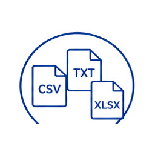

{.chapter-icon fig-alt="Kapitelikon"}

Når du åbner Stifinder på DST-serveren, møder du filer med forskellige endelser.
Denne side er dit opslagsværktøj: hvilken filtype er det, hvilken funktion åbner den, og kommer dataene ind i hukommelsen med det samme eller ej?

Det sidste — **doven vs. fuld indlæsning** — er den vigtigste skelnen på denne side. Mekanismen bag forklares i [Fase 5 — Udtræk trin for trin](05_universelle-moenster.qmd); her skal du bare vide, *hvilke* filtyper der opfører sig hvordan.

---

## Sådan ser en projektmappe ud

Et typisk projekt på DST-serveren er organiseret nogenlunde sådan her. Du arbejder mest i `R/`, `datasets/` og `output/` — selve registrene ligger under `cleaned-data/`:

```
E:/workdata/[projektnummer]/
├── rawdata/                     # rå registerdata fra DST (ofte SAS)
│   └── bef/  lpr_adm/  lpr_diag/  …
├── cleaned-data/
│   └── parquet-registers/       # registre konverteret til parquet
│       └── bef/  lpr_adm/  lpr_a_kontakt/  …
├── R/                           # dine analysescripts (01_, 02_, …)
├── datasets/                    # dine egne mellemresultater (.rds)
└── output/                      # tabeller, figurer og logs
```

Stierne i kodeeksemplerne (`E:/workdata/[projektnummer]/cleaned-data/parquet-registers/…`) følger denne struktur. Din konkrete mappe kan se anderledes ud — tjek med Stifinder. Hvordan du selv navngiver scripts i `R/`, gennemgås i [Fase 12 — God kode-praksis](12_god-kode-praksis.qmd).

---

## Oversigt — filtype, pakke, funktion

| Filtype | Pakke | Funktion | Indlæsning |
|---|---|---|---|
| `.parquet` / parquet-mappe | `arrow` | `open_dataset("sti/til/mappe/")` | **Doven** — intet i RAM før `collect()` |
| `.rds` | base R | `readRDS("sti/til/fil.rds")` | **Fuld** — hele filen ind i RAM |
| `.sas7bdat` | `haven` | `read_sas("sti/til/fil.sas7bdat")` | **Fuld** — hele filen ind i RAM |
| `.csv` | `readr` | `read_csv("sti/til/fil.csv")` | **Fuld** — hele filen ind i RAM |
| `.xlsx` | `readxl` | `read_xlsx("sti/til/fil.xlsx")` | **Fuld** — hele filen ind i RAM |

**Hvad skriver du i parenteserne?**
Du skriver stien til den parquet-mappe der indeholder registret — fx `open_dataset("sti/til/bef/")`. Hvilken sti det konkret er, afhænger af dit projekt og din server. Kolonnenavne for hvert register finder du i [14d — Registerreference](15d_register_reference.qmd).

<details>
<summary>Sjældnere formater (Stata, SPSS, Feather, RData)</summary>

Disse møder du sjældent i et typisk DST-kohortestudie, men her er de for fuldstændighedens skyld:

| Filtype | Pakke | Funktion |
|---|---|---|
| `.dta` (Stata) | `haven` | `read_dta()` |
| `.sav` (SPSS) | `haven` | `read_sav()` |
| `.feather` | `arrow` | `read_feather()` |
| `.rdata` / `.rda` | base R | `load()` |

`.rdata`/`.rda` adskiller sig fra `.rds` ved at kunne gemme flere objekter på én gang — men `.rds` er at foretrække, fordi du selv styrer hvad objektet hedder, når du læser det ind.

</details>

---

## Hvornår bruger du hvad?

De tre du faktisk arbejder med i hverdagen:

| Filtype | Bruges til |
|---|---|
| **Parquet** | De store registre (BEF, LPR, LMDB …). Du indlæser dem dovent og filtrerer, før du henter data. |
| **RDS** | Dine egne mellemresultater — datasæt du gemmer fra ét script og genindlæser i det næste. |
| **SAS** | Formateringstabeller og rå registerdata, der endnu ikke er konverteret til parquet. |

### RDS — det format du selv skriver mest

RDS er R's eget format. Det er hurtigt, kompakt og bevarer alle R-egenskaber (datatyper, faktorniveauer, kolonnenavne) perfekt.

Arbejder du med en pipeline af scripts — fx et script der bygger din kohorte og et andet der trækker diagnoser — gemmer du resultatet fra script 1 som `.rds`, så script 2 kan læse det ind og fortsætte derfra, uden at du behøver køre alt om igen.

```r
saveRDS(kohort, "datasets/full_cohort.rds")   # gem et R-objekt til disk
kohort <- readRDS("datasets/full_cohort.rds")   # læs det ind igen i næste script
```

<details>
<summary>Kodeeksempler: SAS og CSV</summary>

**SAS** — til formateringstabeller og ikke-konverteret registerdata:

```r
library(haven)
df <- read_sas("E:/rawdata/[projektnummer]/lpr_adm2018.sas7bdat")
```

Indlæsning af store SAS-filer er **meget langsomt** — det er netop derfor data på DST er konverteret til parquet. Brug kun SAS til formateringstabeller og filer uden parquet-version.

**CSV** — til eksport af færdige tabeller (fx ved hjemsendelse):

```r
library(readr)
write_csv(min_tabel, "output/tabel1.csv")
```

Gem **aldrig** rå registerdata som CSV — kun aggregerede resultater. Se [Fase 16 — Eksport og hjemsendelse](16_eksport-hjemsendelse.qmd) for reglerne.

</details>

---

## Doven vs. fuld indlæsning — hvad er forskellen i praksis?

Læg mærke til den sidste kolonne i oversigtstabellen. Den deler alt i to:

**Fuld indlæsning** (`readRDS`, `read_sas`, `read_csv`, `read_xlsx`)
Hele filen læses ind i RAM med det samme. For dine egne mellemresultater er det fint — de er relativt små. Men det ville crashe din session, hvis du prøvede det på et helt register.

**Doven indlæsning** (parquet via `open_dataset()`)
Filen åbnes som en *forbindelse*, ikke som data. Du kan filtrere og vælge kolonner, og **først når du kalder `collect()`** flyttes de udvalgte rækker ind i RAM. Det er sådan du arbejder med registre på millioner af rækker uden at løbe tør for hukommelse.

::: {.callout-important}
**SAS-filer er også store — og deles med alle på serveren.**
På DST deler alle brugere serverens RAM. `read_sas()` på en stor SAS-fil belaster serveren for alle på samme tid. Hvis du bruger en SAS-fil gentagne gange, er det værd at konvertere den til parquet én gang — det sparer markant RAM og gør indlæsning meget hurtigere.
Se [Konvertér SAS til parquet](#konvertér-sas-til-parquet) nedenfor for fremgangsmåden.
:::

Hvorfor doven indlæsning fungerer, og hvordan `collect()` virker, er emnet for næste fase.

→ [Fase 5 — Udtræk trin for trin](05_universelle-moenster.qmd)

---

## Konvertér SAS-filer til Parquet {#konvertér-sas-til-parquet}

De fleste projekter på DST modtager registre som SAS-filer (`.sas7bdat`). Inden du kan bruge dem med `open_dataset()` og doven evaluering, skal de konverteres til Parquet **én enkelt gang**. Derefter bruger du dem præcis som alle andre registre.

::: {.callout-important}
**Relevant for de fleste uden for DARTER.** Arbejder du på et projekt hvor registrene ikke allerede er konverteret til parquet, er dette trin nødvendigt inden du kan køre udtræk. Gøres én gang per register — herefter gælder det normale udtræksmønster.
:::

**Hvorfor Parquet er det værd:**

| | SAS (.sas7bdat) | Parquet |
|---|---|---|
| Læsetid (1M rækker) | ~30–120 sek | ~1–3 sek |
| Diskplads | Stor | 50–75 % mindre |
| Kræver pakke | `haven` | `arrow` |
| Doven evaluering | Nej — alt ind i RAM | Ja — filter FØR collect |

**Konverteringen gøres én gang:**

```r
library(haven)    # læs SAS-fil
library(arrow)    # skriv Parquet

sas_fil  <- "E:/workdata/[projektnummer]/raw/mit_register.sas7bdat"
parq_sti <- "E:/workdata/[projektnummer]/cleaned-data/parquet-external/mit_register/"

# 1. Læs SAS-filen ind i R
df <- read_sas(sas_fil)            # læser hele filen ind i RAM — vi kalder den "df", men du kan bruge et hvilket som helst navn

# 2. Standardisér kolonnenavne
df <- df %>% rename_with(tolower)

# 3. Skriv som Parquet
dir.create(parq_sti, recursive = TRUE, showWarnings = FALSE)
write_parquet(df, file.path(parq_sti, "mit_register.parquet"))

# 4. Verificér
open_dataset(parq_sti) %>% glimpse()
```

::: {.callout-tip}
**Store SAS-filer:** `heaven::import_SAS()` (forudinstalleret på DST) er mere effektiv end `read_sas()` til store filer og kan begrænse hvad der læses — fx `keep = c("pnr","atc")`, `where = "..."` (filtrér rækker) eller `obs = 1000` (kun de første rækker, godt til test).
:::

Herefter kan du bruge registret dovent med `open_dataset()` ligesom alle andre:

```r
mit_reg <- open_dataset(parq_sti) %>% rename_with(tolower)
```

**Alternativ:** [`fastreg`](https://github.com/dp-next/fastreg) (dp-next, MIT-licens) giver en mere struktureret pipeline til at konvertere hele DST-workspaces fra SAS til Parquet med `convert()` og en targets-baseret skabelon. Relevant hvis du vil bygge et komplet parquet-workspace fra bunden.
