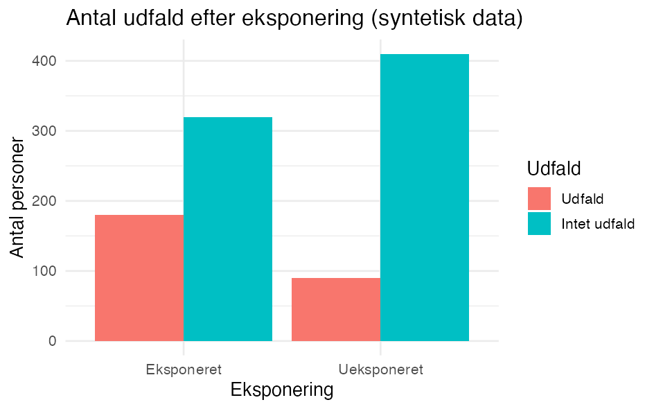
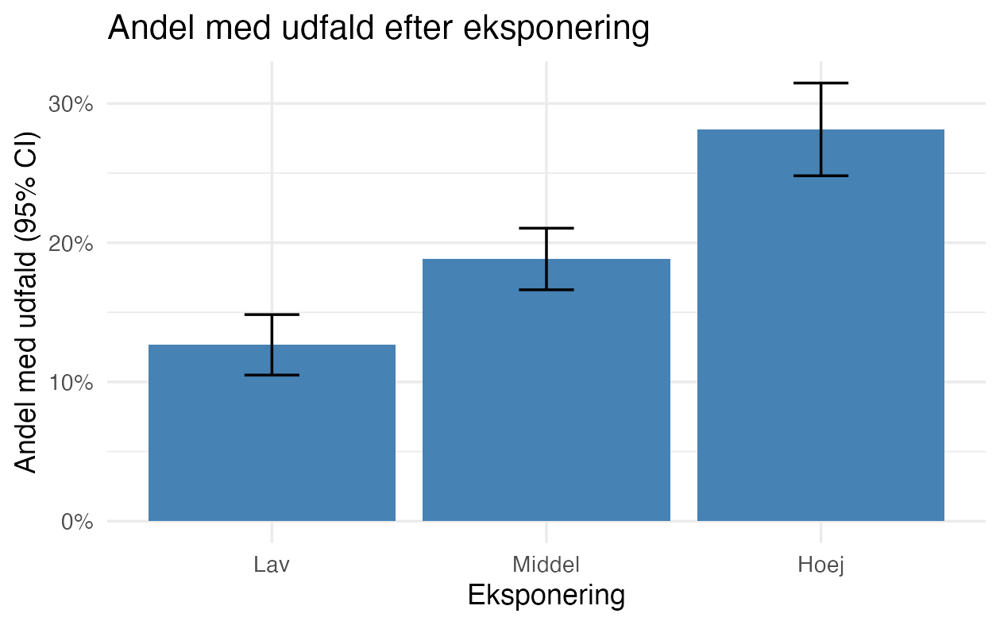

::: {.callout-warning}
**Under udvikling.** Siden viser nogle `ggplot2`-eksempler. Flere figurtyper kommer.
:::

Figurer i R laves ofte med [`ggplot2`](https://ggplot2.tidyverse.org/). Det vigtige på DST er, at **en figur er data**: den skal være **aggregeret**, før den kan sendes til outputkontrol. Et scatterplot med ét punkt per person slipper aldrig igennem - vis i stedet antal, andele, rater eller kurver.

::: {.callout-note}
Kodeeksemplerne bruger generiske sti- og variabelnavne. Tilpas til dit projekt. `ggplot2` skal være installeret i dit R-miljø på DST.
:::

---

## Eksempel

Byg figuren fra dit datasæt. Her tæller vi antal personer per gruppe og tegner et søjlediagram.

```r
library(ggplot2)                       # ggplot(), geom_*, ggsave()
library(dplyr)                         # %>% og count()

df <- readRDS("sti/til/analyse.rds")   # analyseklart datasæt

# Aggreger FØRST - figuren skal vise tal, ikke enkeltpersoner
optaelling <- df %>%
  count(eksponering, udfald)           # antal personer per kombination af de to variable

p <- ggplot(optaelling, aes(x = eksponering, y = n, fill = udfald)) +  # kobl kolonner til akser/farve
  geom_col(position = "dodge") +       # søjler ud fra de optalte tal, side om side per gruppe
  labs(                                # alle tekster på figuren:
    title = "Antal udfald efter eksponering",                  # overskrift
    x = "Eksponering", y = "Antal personer", fill = "Udfald"   # x-akse, y-akse, legende
  ) +
  theme_minimal()                      # rent, lyst udseende

p                                      # skriv figuren ud (vis den i Plots-vinduet)
```

Med syntetiske tal ser figuren sådan ud:



Det vigtigste:

- `aes()` kobler kolonner til figurens akser (`x`, `y`) og fx `fill` (farve).
- `geom_col()` tegner søjler ud fra værdier, du selv har talt op (modsat `geom_bar()`, der selv tæller rækker).
- `labs()` sætter titel og akse-/legende-tekster; `theme_minimal()` giver et rent udseende.

## Tilpas udseendet

En figur bygges op **lag for lag** med `+`: du starter med `ggplot(...)` og lægger en ny linje til for hver ting, du vil ændre. Det, en funktion skal styre, skriver du **inde i dens parentes** `()` som et argument, fx `labs(title = "...")`.

Fordi vi gemte figuren i objektet `p` i kodeblokken ovenfor, kan du bygge videre på den med `+`: du skriver **kun det, du vil lægge til eller ændre** - ikke hele koden igen. (Det kræver, at du har kørt den første kodeblok, så `p` findes i din session.)

```r
p +                                                       # figuren fra før
  labs(                                                   # nye tekster (overskriver dem, p allerede har):
    title = "Antal personer per gruppe",                  #   ny titel
    x = "Gruppe", y = "Antal", fill = "Udfald") +         #   x-akse, y-akse, legende
  scale_fill_manual(values = c("#4C72B0", "#DD8452")) +   # vælg selv søjlefarverne
  theme_minimal(base_size = 14) +                         # rent tema, lidt større skrift
  theme(legend.position = "bottom")                       # flyt signaturforklaringen ned
```

Hver linje er ét lag, og rækkefølgen betyder ikke noget. Et par typiske greb:

- **Farve efter en variabel** sætter du inde i `aes()` (fx `fill = udfald` som i eksemplet øverst på siden); farverne styrer du så med `scale_fill_manual(values = ...)` eller en færdig palet (`scale_fill_brewer()`). Vil du i stedet have **én fast farve** til alle søjler, skriver du `fill = "steelblue"` inde i `geom_col()`, altså *uden for* `aes()`.
- **Akser:** `scale_y_continuous(...)` eller `lims(y = c(0, 100))` styrer inddeling og min/max.
- **Layout:** `coord_flip()` vender søjlerne vandret (godt til mange kategorier); `facet_wrap(~ variabel)` laver ét panel per gruppe.

Hver funktion har mange flere argumenter - slå dem op med fx `?labs` eller `?scale_fill_manual`.

## Figur med fejllinjer (andel og 95% CI)

Søjlediagrammet ovenfor viser rå antal. I registerarbejde vil du ofte hellere vise en **andel eller rate med et konfidensinterval**, så figuren også fortæller om usikkerheden. Fejllinjer (`geom_errorbar()`) tegner intervallet oven på hver søjle eller hvert punkt.

Aggreger igen først: én række per gruppe med antal, andel og interval. Her antager vi, at `udfald` er kodet 0/1.

```r
library(ggplot2)                       # ggplot(), geom_col(), geom_errorbar()
library(dplyr)                         # %>%, group_by(), summarise()

df <- readRDS("sti/til/analyse.rds")   # analyseklart datasæt; udfald er 0/1

# Aggreger til én række per gruppe: antal, andel med udfald og et 95% CI
andele <- df %>%
  group_by(eksponering) %>%                        # én gruppe per eksponeringsniveau
  summarise(
    n     = n(),                                   # antal personer i gruppen
    x     = sum(udfald),                           # antal med udfald (udfald kodet 0/1)
    andel = x / n,                                 # andel med udfald
    se    = sqrt(andel * (1 - andel) / n),         # standardfejl på andelen
    .groups = "drop"
  ) %>%
  mutate(
    nedre = andel - 1.96 * se,                     # nedre grænse for 95% CI
    oevre = andel + 1.96 * se                      # øvre grænse for 95% CI
  )

p2 <- ggplot(andele, aes(x = eksponering, y = andel)) +   # andel på y-aksen
  geom_col(fill = "steelblue") +                          # søjle for andelen
  geom_errorbar(aes(ymin = nedre, ymax = oevre),          # fejllinjer = 95% CI
                width = 0.2) +                            # bredde på "hatten" på linjen
  scale_y_continuous(labels = scales::percent) +          # vis y-aksen i procent
  labs(
    title = "Andel med udfald efter eksponering",
    x = "Eksponering", y = "Andel med udfald (95% CI)"
  ) +
  theme_minimal()

p2                                     # skriv figuren ud
```

Med syntetiske tal ser figuren sådan ud:



Det vigtigste:

- `geom_errorbar()` skal bruge `ymin` og `ymax`; vi har regnet dem som `andel ± 1.96 · se` og lægger dem i datasættet på forhånd.
- Intervallet her er et simpelt **Wald-interval**. Det er fint for de store grupper, outputkontrol alligevel kræver, men bliver upålideligt ved få personer eller andele tæt på 0 eller 100 %. Brug da et bedre interval, fx `prop.test()` eller `binom`-pakken.
- **Samme mønster til gennemsnit:** vil du vise et gennemsnit af en kontinuert variabel per gruppe (fx alder ved index), så erstat `andel` med `mean(variabel)` og `se` med `sd(variabel) / sqrt(n)`. Resten af figuren er den samme.

## Gem figuren

`ggsave()` skriver den seneste (eller en navngiven) figur til en fil, du kan sende til outputkontrol.

```r
ggsave("figur1.png", plot = p,         # gem figuren p til en fil
       width = 16, height = 10, units = "cm",  # fysisk størrelse
       dpi = 300)                       # opløsning (300 = trykkvalitet)
```

- `width` / `height` + `units` (`"cm"`, `"mm"`, `"in"` eller `"px"`) bestemmer den fysiske størrelse; `dpi = 300` er en god opløsning til tryk.
- Vælg `.png` (raster) eller `.pdf` (vektor, skalerer skarpt) afhængigt af tidsskriftets krav.

## Outputkontrol gælder også figurer

En figur indeholder data. Aggreger altid, og undgå at vise grupper med få personer: en søjle eller et punkt, der dækker ganske få individer, kan afsløre dem. Vis ingen enkeltperson-punkter.

::: {.callout-note}
Husk: alt der forlader DST skal gennem **outputkontrol** - ingen små celler, kun aggregerede resultater. Se [Fase 14 - Eksport og hjemsendelse](14_eksport-hjemsendelse.qmd).
:::


::: {.callout-tip}
## Læs mere

Generel uddybning i *The Epidemiologist R Handbook* (på engelsk):

- [ggplot basics](https://www.epirhandbook.com/en/new_pages/ggplot_basics.html)
- [ggplot tips](https://www.epirhandbook.com/en/new_pages/ggplot_tips.html)
:::
