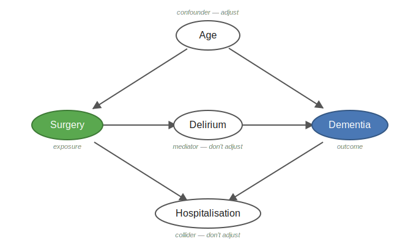

Register-based research does not start in R. It starts with pen and paper.
This page guides you through the things you should have in place before writing a single line of code.

::: {.callout-tip}
**In short:** Settle four things on paper before you code — a precise research question, your data model (which registers cover exposure, outcome and covariates), your covariates chosen with a DAG, and your comparison cohort.
:::

---

## What type of study are you doing? {#studietype}

Almost all register-based research is **observational and analytical** — you observe what has already happened, without intervening. The two classic analytical designs are **case-control** and **cohort**; [Phase 10](10_byg-din-kohorte.qmd) shows how to build a matched cohort study. Randomised trials (RCT) cannot be done with register data and are included here only for the overview.

```{mermaid}
flowchart TD
    E["Epidemiological studies"]:::neutral
    O["Observational<br>— register research lives here"]:::active
    X["Experimental"]:::ref
    D["Descriptive"]:::active
    A["Analytical"]:::active
    CC["Case-control"]:::active
    CO["Cohort"]:::active
    R["RCT<br>— requires intervention,<br>not possible with register data"]:::ref

    E --> O
    E --> X
    O --> D
    O --> A
    A --> CC
    A --> CO
    X --> R

    classDef neutral fill:#eef0f2,stroke:#8a94a6,color:#1f2733;
    classDef active fill:#eaf2fb,stroke:#4a78b5,color:#173a5e;
    classDef ref fill:#f6f6f6,stroke:#cccccc,color:#999999;
```

<details>
<summary>Case-control or cohort — what is the difference?</summary>

The two analytical designs differ in **which end you start from**:

| | Cohort | Case-control |
|---|---|---|
| **Starting point** | Exposure | Outcome |
| **Direction** | Follows forward: exposed → outcome | Looks back: case → prior exposure |
| **Best when** | Exposure is rare; multiple outcomes | Outcome is rare; single outcome |
| **Effect measure** | Incidence, relative risk (RR), hazard ratio | Odds ratio (OR) |
| **In registers** | Define exposed group + comparator cohort, follow forward | Find all cases, select controls, look back at exposure |

**Cohort** follows persons forward in time from the index date and measures how many develop the outcome — which is why you can compute incidence and risk. Well suited when you have multiple outcomes (cf. the `alle_dx` approach in [Phase 9b](09b_udtraek_fra_lpr.qmd)).

**Case-control** starts from those who already *have* the outcome and matches them with controls without it — efficient for rare outcomes, but cannot compute absolute risk.

With register data you can do both, because the entire population's history is available. [Phase 10](10_byg-din-kohorte.qmd) shows a **matched cohort study** step by step.

</details>

---

## Key concepts {#key-concepts}

Before planning a study it is worth knowing these terms — they are used throughout the guide.

**Cohort**
A group of people followed over time because they share a particular characteristic at a particular point in time.
Example: all patients who underwent bariatric surgery in the period 2010–2020.

**Index date**
The start date of follow-up — the point from which you begin counting.
For operated patients this is typically the date of surgery. For matched comparators the same date as the matched operated patient is assigned.

**Exposure**
The factor whose effect you are investigating — e.g. a surgery, a medication, or a diagnosis.

**Outcome**
What you are measuring — e.g. onset of a disease, a hospitalisation, or death.

**Covariates**
Variables you include to account for confounding — factors that affect both exposure and outcome.
Examples: age, sex, comorbidity, socioeconomic status.

---

## 1. What do I want to investigate?

Formulate your research question precisely before looking at any data.
A vague question produces a messy dataset. A precise question produces a clear plan.

Ask yourself:

| Question | Example |
|---|---|
| Who is my population? | All adults with T2D in Denmark, 2010–2020 |
| What is my exposure? | Bariatric surgery |
| What is my outcome? | Dementia |
| When does follow-up start? | Date of surgery (index date) |
| When does it end? | Diagnosis, death, emigration, or end of study period |
| Which confounders should be adjusted for? | Age, sex, comorbidity, SES |

---

## 2. Which registers cover what?

Before mapping your data model it is useful to know which registers exist.

| What do you need to find? | Register |
|---|---|
| Demographics (age, sex, residence) | BEF — Population Register |
| Hospital diagnoses and contacts | LPR — National Patient Register (LPR2 + LPR3) |
| Dispensed prescriptions | LMDB — Prescription Register |
| Date of death (for censoring) | DODSAARS — Death Register |
| Emigration (for censoring) | VNDS — Migration Register |
| Education | UDDA — Education Register |
| Income | FAIK — Family Income Register |
| Employment | AKM — Labour Classification Module |

A complete description of all registers with column names and join keys is in [Overview of registers →](15d_register_reference.qmd)

---

## 3. Choose your covariates using a DAG

Which variables should you adjust for? The answer is not "as many as possible". Adjusting for the wrong variables can **introduce** bias rather than remove it.

A **DAG** (directed acyclic graph — a causal diagram) is a drawing of your assumptions about how exposure, outcome and other variables relate to each other. It makes your assumptions explicit and helps you choose the right set of covariates.

Rules of thumb:

- **Adjust for confounders** — variables that affect both exposure and outcome (e.g. age, comorbidity).
- **Do NOT adjust for mediators** — variables that lie *on* the causal pathway between exposure and outcome (this removes part of the effect you want to measure).
- **Do NOT adjust for colliders** — common effects of two variables (this opens a spurious association).

<details>
<summary>Example: surgery and dementia — a DAG with confounder, mediator and collider</summary>

A concrete example: does **surgery** affect the risk of **dementia**?

{#fig-dag fig-alt="Causal diagram with five variables: surgery (exposure), dementia (outcome), age (confounder), delirium (mediator) and hospitalisation (collider)." width="92%"}

- **Age** is a *confounder* — it affects both the probability of surgery and of dementia. **Adjust for it.**
- **Delirium** (post-operative delirium) is a *mediator* — it lies on the path surgery → delirium → dementia. **Do not adjust** — that removes part of the effect you want to measure.
- **Hospitalisation** is a *collider* — both surgery and dementia lead to hospitalisation. **Do not adjust** — it opens a spurious association.

You can paste the model straight into [dagitty.net](https://dagitty.net/dags.html) and have the minimal adjustment set computed:

```
dag {
  Age            [pos="0,-1"]
  Surgery        [exposure, pos="-1.5,0"]
  Delirium       [pos="0,0"]
  Dementia       [outcome,  pos="1.5,0"]
  Hospitalisation [pos="0,1"]
  Age      -> Surgery
  Age      -> Dementia
  Surgery  -> Delirium
  Delirium -> Dementia
  Surgery  -> Hospitalisation
  Dementia -> Hospitalisation
}
```

For this DAG the minimal adjustment set is **{Age}** — you only need to adjust for age.

</details>

::: {.callout-tip}
**Tools**

- [dagitty.net](https://dagitty.net/) — draw your diagram in the browser; it automatically calculates the minimal set of covariates to adjust for.
- [Causal Diagrams: Draw Your Assumptions Before Your Conclusions](https://pll.harvard.edu/course/causal-diagrams-draw-your-assumptions-your-conclusions) — free HarvardX course by Miguel Hernán on exactly this.
- Background: [Hernán & Robins, *Causal Inference: What If*](https://miguelhernan.org/whatifbook) (free PDF) — also in [Learning resources](15e_laeringsressourcer.qmd).
:::

---

## 4. The comparator cohort {#comparator-cohort}

Many studies compare an exposed group with a **comparator cohort**. How you build it is a design decision to be made on paper — before writing code.

Things to consider:

- **Who is an appropriate comparator?** E.g. for bariatric surgery: people with severe obesity who were *not* operated on, or a matched background population. The choice depends on the question.
- **Index date for the comparator cohort.** Your exposed cohort has an index date determined by the exposure (e.g. the surgery date). The comparator cohort does not — it must be *assigned* a date, typically the same date as the matched exposed person, so both groups are followed from a comparable point in time.
- **Eligibility at index.** The comparator cohort must meet the inclusion criteria on their assigned index date — otherwise you risk *immortal time bias* (a distortion that arises when a person is assigned exposure time during which they by definition could not yet have experienced the outcome).
- **Matching variables and ratio.** E.g. age, sex and calendar year; decide the ratio (e.g. 1:5).
- **Can anyone in the comparator cohort become exposed later?** E.g. can a person who started as a control later undergo surgery? Decide what happens in that case — whether they remain a control or transfer to the exposed group.
- **The same exclusions** are applied to both groups.

→ The complete pattern for cohort construction and matching is in [Phase 10 — Build your study population](10_byg-din-kohorte.qmd).

---

## 5. Get an overview — pen and paper

Before opening R, answer these questions in writing:

1. **Which variables do I need?** (patient information — age, sex, diagnoses etc. — and for which years)
2. **Which registers contain this information?** (LPR, BEF, LMDB, ...)
3. **In what order should data be assembled?** (define population → extract outcome → extract covariates)

A solid overview on paper saves many hours of debugging in code.

<details>
<summary>Example: overview for a dementia study</summary>

```
Population:   Adults who have undergone bariatric surgery (identified via the Danish Obesity
              Treatment Database — DBSO), 2010–2024
              Matched comparators from the Population Register (BEF)

Outcome:      First dementia diagnosis (LPR — ICD-10: F00–F03, G30–G31)
              Date: first contact with a dementia code after the surgery date

Covariates:   Age and sex (BEF)
              Comorbidity (LPR — 5-year lookback, i.e. diagnoses in the 5 years before index date)
              Education (UDDA)
              Income (FAIK via BEF familie_id)
              Employment (AKM)

Censoring:    Death (DODSAARS)
              Emigration (VNDS)
              End of study period (31 Dec 2024)
```

</details>

---

## 6. Write an analysis plan

An analysis plan is a document you write **before** looking at your data.
It forces you to commit to design, statistics and variables before results can colour your decisions.

**Use the STROBE checklist** as a skeleton:
[STROBE Statement — checklists →](https://www.strobe-statement.org/checklists/)

**Pre-register your analysis plan on e.g. OSF** — this is good scientific practice and required by many journals:
[Open Science Framework — registration templates](https://help.osf.io/article/330-welcome-to-registrations)

---

## 7. Next steps

Once you have your overview in place:

- **New to R?** → [Phase 2 — R: the bare essentials](02_r-intro.qmd)
- **Ready for the DST server?** → [Phase 3 — Log in to DST](03_log-ind-dst.qmd)
- **Working on DARTER / project 708421?** → Read this first: [DARTER — overview and pipeline](darter/00_index.qmd)
