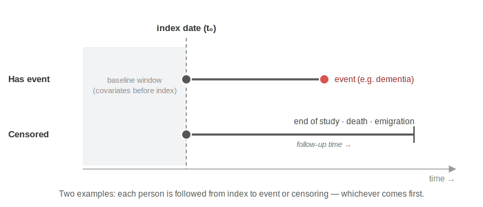

All extractions in the other phases — outcomes ([Phase 9](09b_udtraek_fra_lpr.qmd)), covariates ([Phase 6](06_foerste-udtraek.qmd)) and socioeconomics ([Phase 13](13_socioekonomiske-variable.qmd)) — assume you already have a cohort: a table with `pnr` and `index_date` per person. This page shows how to build it from scratch.

::: {.callout-tip}
**In short:** You build your study population in six steps — identify the exposed (1), exclude prevalent cases (2), build a match pool (3), apply eligibility criteria (4), match a comparison cohort (5) and save the cohort (6). The result is a table with `pnr` + `index_date` per person.
:::

::: {.callout-warning}
**This page is still under development.** The code needs further review and testing before being used directly. Use it as structural guidance and adapt to your own project.
:::

::: {.callout-note}
**Study design determines the approach.**
This page shows an active cohort study with matching — one exposed group and one comparator cohort. Adapt step 1 to your exposure definition: SKS code, ICD diagnosis, ATC code, clinical measurement or other.
:::

::: {.callout-note}
**Functions used on this page.**
`inner_join()` and `bind_rows()` are shown in [Phase 9](09b_udtraek_fra_lpr.qmd). `group_by() + slice()` is shown briefly there and explained in detail in [Phase 11](11_data-manipulation.qmd). `anti_join()` is new here — see explanation in the relevant code block below and in detail in [Phase 11](11_data-manipulation.qmd#joins-link-two-tables).
:::

---

## What is index date?

**Index date** is the point in time that marks the start of follow-up for a given person.

- **Exposed:** the date the person received the exposure (e.g. surgery date, diagnosis date, first prescription dispensed)
- **Comparator cohort:** the index date assigned from the matched exposed person

Everything that follows — outcome date, covariates at baseline, follow-up time — is calculated relative to index date. The definition of index date is crucial for study validity.

{fig-alt="Timeline with two example persons: one who has the event and one who is censored, both followed from the index date." width="100%"}

---

## Step 1 — Identify the exposed

You scan the register that defines your exposure. **You do not yet have a `cohort_pnrs` list — you query the entire register** and filter on the exposure criterion.

**The exposure can be defined in many ways:**

| Type | Example | Register |
|---|---|---|
| Surgery / procedure (SKS code) | Bariatric surgery KJDF10/KJDF11 | `lpr_sksopr`^a^ (LPR2), `procedurer_kirurgi`^a^ (LPR3) |
| Hospital diagnosis (ICD code) | Type 2 diabetes E11 | `lpr_diag` + `lpr_adm`, `lpr_a_diagnose` + `lpr_a_kontakt` |
| Medication exposure (ATC code) | Metformin A10BA02 | LMDB |
| Clinical measurement / biomarker | BMI > 35, HbA1c > 75 mmol/mol | Project-specific data / OSDC / DBSO |

^a^ `lpr_sksopr` and `procedurer_kirurgi` are the names on the DARTER project (708421) — see [Register reference](15d_register_reference.qmd). Names may vary on other projects.

<details>
<summary>Example A: SKS codes (surgery/procedure)</summary>

```r
library(arrow)    # open_dataset
library(dplyr)    # filter, select, group_by, slice, ungroup, bind_rows, mutate

# Adapt these codes to your study
RYGB     <- c("KJDF10", "KJDF11")                     # Roux-en-Y gastric bypass
SG       <- c("KJDF40", "KJDF41", "KJDF96", "KJDF97") # sleeve gastrectomy
BS_CODES <- c(RYGB, SG)                               # combined vector

# ── LPR2: procedures up to 2018/2019 ────────────────────────────────────
lpr_sksopr <- open_dataset("E:/workdata/[projectnumber]/cleaned-data/parquet-registers/lpr_sksopr/") %>%
  rename_with(tolower)
lpr_adm    <- open_dataset("E:/workdata/[projectnumber]/cleaned-data/parquet-registers/lpr_adm/") %>%
  rename_with(tolower)

exp_lpr2 <- lpr_sksopr %>%
  filter(c_opr %in% !!BS_CODES) %>%                        # only bariatric procedures
  select(recnum, sks_code = c_opr) %>%                      # recnum is the join key to lpr_adm
  inner_join(
    lpr_adm %>% select(pnr, recnum, index_date = d_inddto), # attach pnr and date
    by = "recnum"
  ) %>%
  collect()

# ── LPR3: procedures from 2019 onwards ──────────────────────────────────
proc_kir <- open_dataset("E:/workdata/[projectnumber]/cleaned-data/parquet-registers/procedurer_kirurgi/") %>%
  rename_with(tolower)
lpr_a_k  <- open_dataset("E:/workdata/[projectnumber]/cleaned-data/parquet-registers/lpr_a_kontakt/") %>%
  rename_with(tolower)

exp_lpr3 <- proc_kir %>%
  filter(procedurekode %in% !!BS_CODES) %>%                 # only bariatric procedures
  select(dw_ek_forloeb, sks_code = procedurekode) %>%
  inner_join(
    lpr_a_k %>% select(pnr, dw_ek_forloeb, index_date = kont_starttidspunkt),
    by = "dw_ek_forloeb"
  ) %>%
  collect() %>%
  mutate(index_date = as.Date(index_date))                  # datetime → date

# ── Combine and take one procedure per person (the first) ───────────────
# The result is called "exposed" — only the exposed group, NOT the full cohort yet
exposed <- bind_rows(exp_lpr2, exp_lpr3) %>%
  group_by(pnr) %>%                                        # group per person
  arrange(index_date) %>%                                   # oldest date first
  slice(1) %>%                                              # one procedure per person (the first)
  ungroup() %>%                                             # release grouping (see Phase 11)
  mutate(exposed = 1L)                                      # mark as exposed (1 = yes)

nrow(exposed)                                              # number of unique operated individuals
```

::: {.callout-tip}
`exposed` contains only the operated individuals. The full cohort (exposed + comparator cohort) is built in step 5 and saved as `cohort`. It is `cohort` — not `exposed` — that you use as `cohort_pnrs` in the other phases.
:::

</details>

<details>
<summary>Example B: ICD diagnosis as exposure criterion</summary>

```r
# Same LPR pattern as Phase 9 — but without filter(pnr %in% !!cohort_pnrs),
# as the cohort does not yet exist. You query the full population to identify the exposed.
lpr_diag <- open_dataset("E:/workdata/[projectnumber]/cleaned-data/parquet-registers/lpr_diag/") %>%
  rename_with(tolower)
lpr_adm  <- open_dataset("E:/workdata/[projectnumber]/cleaned-data/parquet-registers/lpr_adm/") %>%
  rename_with(tolower)

exposed <- lpr_adm %>%
  inner_join(
    lpr_diag %>%
      filter(c_diagtype %in% c("A", "B"),
             substr(c_diag, 2, 4) == "E11") %>%             # T2D: "DE11" → strip D-prefix
      select(recnum, c_diag),
    by = "recnum"
  ) %>%
  select(pnr, index_date = d_inddto) %>%
  collect() %>%
  group_by(pnr) %>%
  arrange(index_date) %>%
  slice(1) %>%                                              # first diagnosis per person
  ungroup() %>%
  mutate(exposed = 1L)
```

</details>

---

::: {.callout-tip}
**What should you do after step 1?**

- **Prevalence study** — you now have your study population with an index date. Skip steps 2–6 and go directly to [Phase 6 — Extract covariates](06_foerste-udtraek.qmd) and [Phase 11 — Assemble the dataset](11_data-manipulation.qmd).
- **Cohort study or nested case-control** — continue with steps 2–6 below.

*Note for case-control:* your "exposed" group in step 1 is your **cases** (those who experienced the outcome, identified from LPR), not an exposure. Steps 3–6 then sample **controls** — people without the outcome who were at risk at the time each case received their diagnosis.
:::

## Step 2 — Exclude prevalent cases {.step-heading}

Exclude persons who already had the diagnosis *before* index date — otherwise they count as new cases even though they are not. This step must happen **before** matching, so the comparator pool is not sampled from a contaminated source.

You need your extracted LPR diagnosis table from [Phase 9](09b_udtraek_fra_lpr.qmd) — either `alle_dx` or your direct extraction.

<details>
<summary>Show code</summary>

```r
EXCL_CODES <- c("G30", "F00", "F01", "F02", "F03")   # change to your own exclusion codes

# diagnoses = alle_dx (Approach 2) or your direct extraction (Approach 1) from Phase 9
prevalent <- diagnoses %>%
  filter(icd3 %in% EXCL_CODES) %>%
  inner_join(exposed %>% select(pnr, index_date), by = "pnr") %>%
  filter(date_contact < index_date) %>%
  distinct(pnr)

cat("Exposed before exclusion: ", nrow(exposed),                        "\n")
exposed_excl <- exposed %>%
  anti_join(prevalent, by = "pnr")
cat("Exposed after exclusion:  ", nrow(exposed_excl),                   "\n")
cat("Excluded:                 ", nrow(exposed) - nrow(exposed_excl),   "\n")
```

</details>

::: {.callout-tip}
**Lookback period:** Consider restricting `date_contact < index_date` further — e.g. only the 5 years before index — to avoid false exclusions based on very old diagnoses.

```r
filter(date_contact >= index_date - 365*5,
       date_contact < index_date)
```
:::

::: {.callout-note}
Prevalence exclusion also applies to the **matchpool** (step 3) — exclude people with prevalent outcome from the pool too, otherwise your exposed are matched to persons who were not actually at risk.
:::

---

## Step 3 — Build matchpool from BEF

Comparator candidates are drawn from BEF — everyone in the population not yet exposed. Add the variables you want to match on (birth year, sex, calendar year etc.).

<details>
<summary>Show code</summary>

```r
bef <- open_dataset("E:/workdata/[projectnumber]/cleaned-data/parquet-registers/bef/") %>%
  rename_with(tolower)

matchpool <- bef %>%
  filter(aar == 2015) %>%                                   # one BEF snapshot — adjust to your study window
  select(pnr, foed_dag, koen) %>%
  collect() %>%
  anti_join(exposed, by = "pnr") %>%                        # keep only pnr's NOT in exposed
                                                            # anti_join = inverse inner_join: no match = keep
                                                            # see Phase 11 for full explanation of join types
  mutate(
    birth_year = as.integer(format(as.Date(foed_dag), "%Y")),  # matching variable
    exposed    = 0L                                            # mark as potential comparator
  )

nrow(matchpool)                                             # number of potential comparators
```

</details>

---

## Step 4 — Apply inclusion criteria BEFORE sampling

::: {.callout-important}
**Inclusion criteria must be applied BEFORE matching — not after.**
Exclusion of e.g. persons under 18 or not residing in Denmark must happen on the **matchpool** before comparators are sampled. Excluding after matching introduces systematic bias, because you change the population that the exposed are matched to.

See: [Lund et al., *Clinical Epidemiology* 2015](https://doi.org/10.2147/CLEP.S164456) for a review of bias from incorrect exclusion order.
:::

<details>
<summary>Show code</summary>

```r
# Attach BEF variables to matchpool and apply inclusion criteria
bef_baseline <- bef %>%
  filter(aar == 2015) %>%                                   # use same snapshot year
  select(pnr, alder, opr_land) %>%
  collect()

matchpool_clean <- matchpool %>%
  inner_join(bef_baseline, by = "pnr") %>%
  filter(
    alder >= 18,                                            # adults only
    opr_land == 5100                                        # Danish residence
  )

# Apply the same criteria to exposed (prevalence exclusion already done in Step 2):
exposed_clean <- exposed_excl %>%
  inner_join(bef_baseline, by = "pnr") %>%
  filter(alder >= 18, opr_land == 5100)
```

</details>

---

## Step 5 — Match comparators

`heaven::riskSetMatch()` implements risk-set sampling / incidence-density sampling — the standard in register-based cohorts.

<details>
<summary>Show code</summary>

```r
library(heaven)   # riskSetMatch

# Combine into one dataset: exposed = 1 (exposed) and exposed = 0 (potential comparator)
pool <- bind_rows(
  exposed_clean %>% select(pnr, index_date, exposed, koen, birth_year),
  matchpool_clean %>% select(pnr, exposed, koen, birth_year)
)

# Risk-set matching — 1:5 on sex and birth year
# The result "matched" becomes your full cohort: exposed + matched comparators
matched <- riskSetMatch(
  ptid   = "pnr",                          # personal identifier
  event  = "exposed",                      # 1 = exposed, 0 = potential comparator
  terms  = c("koen", "birth_year"),        # matching variables — adapt to your study
  dat    = pool,
  ratio  = 5                               # up to 5 comparators per exposed
)
```

</details>

::: {.callout-note}
**Chronological sampling and replacement.**
`riskSetMatch()` samples chronologically — persons can contribute to the comparator cohort up until the point they themselves become exposed. Take an explicit position on whether there should be **replacement** (a person can be matched to multiple exposed individuals) or not. Replacement increases effective sample size but gives correlated observations — this must be handled in the analysis. See [Lund et al. 2015](https://doi.org/10.2147/CLEP.S164456) and `?riskSetMatch` for details.

`riskSetMatch()` is explained in [Phase 14a — Packages](14a_pakker-oversigt.qmd) and the design choice behind matching in [Phase 1](01_studieforberedelse.qmd#comparator-cohort).
:::

Matched comparators are automatically assigned the matched exposed person's index date.

<details>
<summary>More in depth — pitfalls when building the comparison cohort</summary>

- **Immortal time bias:** a person in the comparison cohort must be alive, resident in Denmark and meet the eligibility criteria **on their assigned index date** — not only at the start of the study.
- **Risk-set / incidence-density sampling:** a person can appear in the comparison cohort and *later* become exposed themselves and become a case. Decide how you handle that (`riskSetMatch()` supports risk-set matching).
- **Matching ratio:** e.g. 1:5 exposed:comparison — more controls give more precision, but with diminishing returns.
- **The same exclusions** are applied to both groups, otherwise you introduce selection bias.

</details>

---

## Step 6 — Save your cohort

```r
# "matched" from riskSetMatch() is now your full cohort:
# exposed (exposed = 1) + matched comparators (exposed = 0)
kohort <- matched   # rename to "kohort" — this is what you use from now on

saveRDS(kohort, "datasets/full_cohort.rds")   # save

# Verify:
nrow(kohort)                                  # total number of persons
table(kohort$exposed)                         # 0 = comparator cohort, 1 = exposed
names(kohort)                                 # which columns are included?
```

---

## What now?

You have `full_cohort.rds` — one row per person with `pnr` and `index_date` for **both groups** (exposed + comparator cohort). Use it in all subsequent extractions:

```r
kohort      <- readRDS("datasets/full_cohort.rds")
cohort_pnrs <- unique(kohort$pnr)   # vector with all pnr's — this is what is inserted
                                    # wherever the other phases use "cohort_pnrs"
```

`cohort_pnrs` thus contains the pnr's for **both exposed and comparators** — not just the exposed. This is important: extraction of outcomes and covariates must cover the entire study population.

| Extraction | Phase |
|---|---|
| Outcomes (diagnoses, date of death, emigration) | [Phase 9](09b_udtraek_fra_lpr.qmd), [Phase 11](11_data-manipulation.qmd) |
| Covariates from BEF (age, sex) | [Phase 6](06_foerste-udtraek.qmd) |
| Socioeconomic variables | [Phase 13](13_socioekonomiske-variable.qmd) |
| Comorbidity (NMI, Charlson) | [Phase 14c](14c_nmi.qmd) |
| Assemble into one analysis dataset | [Phase 11](11_data-manipulation.qmd) |

---

## See also

- [Phase 1 — Study preparation](01_studieforberedelse.qmd) — design choices behind cohort and matching
- [Phase 9 — Hospital contacts (LPR)](09b_udtraek_fra_lpr.qmd) — diagnosis pattern for exposure identification and prevalence exclusion
- [Phase 11 — Joins and pivots](11_data-manipulation.qmd) — assemble all extracts into one dataset
- [Phase 15d — Register reference](15d_register_reference.qmd) — column names for lpr_sksopr, procedurer_kirurgi etc.
- [Lund et al. (2015), *Clinical Epidemiology*](https://doi.org/10.2147/CLEP.S164456) — bias from incorrect exclusion order in risk-set sampling
