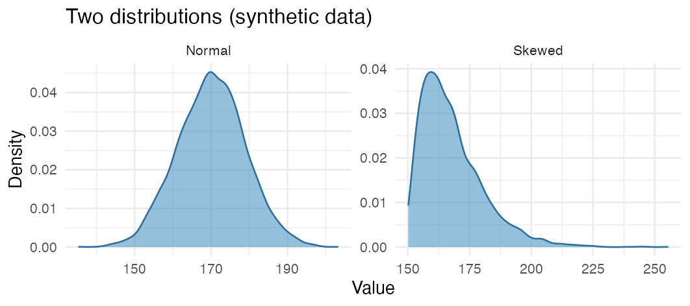
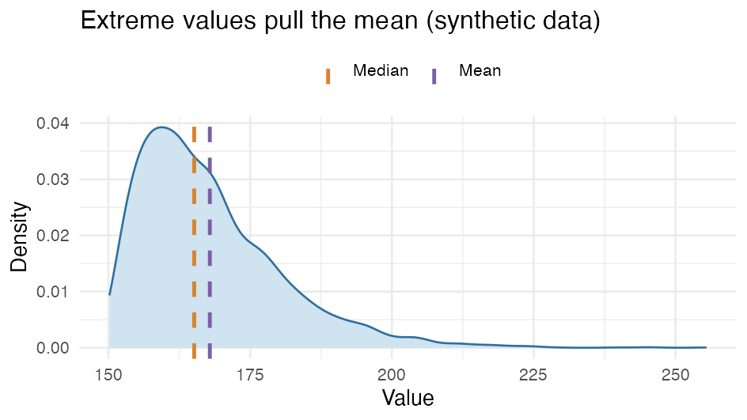

::: {.callout-warning}
**Under development - needs further review.** Use the page as a quick pointer, not the final word: always check the assumptions and your analysis plan, and look things up if in doubt. An interactive "click your way through" version is on the way.
:::

**Start with your question.** First state your research question and **null hypothesis** - they drive everything else.

::: {.callout-note}
In the R commands in the tables, `x`, `y`, `group`, `m0` etc. are **placeholders** - replace them with your own variable and value names. Commands written as `package::function` (e.g. `survival::coxph`, `epitools::riskratio`) come from a **package** that must be installed on DST; the rest are base R (the `stats` package, always available). Regression and time-to-event are expanded in [Regression](13d_regression.qmd) and [Time-to-event](13e_time-to-event.qmd).
:::

::: {.callout-tip}
**Prefer a flowchart?** Antoine Soetewey's [decision tree for choosing a statistical test](https://statsandr.com/blog/what-statistical-test-should-i-do/) is an excellent visual companion to the tables here - you click through data type, number of groups, paired/unpaired and distribution.
:::

---

**Find the right test - three questions:**

1. **What data type is your outcome?** Numeric (a number), binary (yes/no) or time-to-event (time until an event). This picks the **tab** below.
2. **Are your data paired or unpaired?** The same person measured several times or in 1:1 matched pairs = paired; otherwise unpaired. This picks the **row** in the table.
3. **Are the assumptions for a parametric test met?** If they are, use the parametric one; otherwise the nonparametric counterpart. This picks between the two **rows** in each block.

New to the concepts? Expand them under [Concepts in brief](#concepts-in-brief-click-to-expand) at the bottom.

::: {.panel-tabset}

## Numeric / continuous data

<table class="table">
<thead>
<tr><th>Analysis type</th><th>Paired?</th><th>Purpose</th><th>Parametric?</th><th>Test</th><th>Assumptions</th><th>R</th></tr>
</thead>
<tbody>
<tr>
<td rowspan="2">Mean, one group</td>
<td rowspan="2">Irrelevant</td>
<td rowspan="2">Compare one group to a hypothetical value</td>
<td>Parametric</td><td>One-sample t-test</td><td>Normal distribution; independent</td><td><code>t.test(x, mu = m0)</code></td>
</tr>
<tr>
<td>Nonparametric</td><td>Wilcoxon signed-rank</td><td>Symmetric distribution about the median; independent</td><td><code>wilcox.test(x, mu = m0)</code></td>
</tr>
<tr>
<td rowspan="4">Mean, two groups</td>
<td rowspan="2">Unpaired</td>
<td rowspan="2">Compare two unpaired groups</td>
<td>Parametric</td><td>Unpaired t-test</td><td>Normal in both; (equal variance); independent</td><td><code>t.test(y ~ group)</code></td>
</tr>
<tr>
<td>Nonparametric</td><td>Mann-Whitney (rank-sum)</td><td>Independent; same distribution shape</td><td><code>wilcox.test(y ~ group)</code></td>
</tr>
<tr>
<td rowspan="2">Paired</td>
<td rowspan="2">Compare two paired groups</td>
<td>Parametric</td><td>Paired t-test</td><td>Normally distributed paired differences</td><td><code>t.test(x1, x2, paired = TRUE)</code></td>
</tr>
<tr>
<td>Nonparametric</td><td>Wilcoxon signed-rank</td><td>Symmetric paired differences; independent</td><td><code>wilcox.test(x1, x2, paired = TRUE)</code></td>
</tr>
<tr>
<td>Regression</td>
<td>Unpaired</td>
<td>General linear model for the mean</td>
<td>Parametric</td><td>Linear regression</td><td>Normal distribution; independent</td><td><code>lm(y ~ x)</code></td>
</tr>
<tr>
<td rowspan="2">Mean, several groups</td>
<td rowspan="2">Unpaired</td>
<td rowspan="2">Compare several means</td>
<td>Parametric</td><td>One-way ANOVA</td><td>Normal distribution; independent</td><td><code>aov(y ~ group)</code></td>
</tr>
<tr>
<td>Nonparametric</td><td>Kruskal-Wallis</td><td>Independent; same distribution shape</td><td><code>kruskal.test(y ~ group)</code></td>
</tr>
<tr>
<td rowspan="2">Relationship (correlation)</td>
<td rowspan="2">Irrelevant</td>
<td rowspan="2">Describe the relationship between two continuous variables</td>
<td>Parametric</td><td>Pearson correlation</td><td>Linear relationship; normal; independent</td><td><code>cor.test(x, y)</code></td>
</tr>
<tr>
<td>Nonparametric</td><td>Spearman rank correlation</td><td>Monotonic relationship; independent</td><td><code>cor.test(x, y, method = "spearman")</code></td>
</tr>
</tbody>
</table>

## Binary / dichotomous data

<table class="table">
<thead>
<tr><th>Analysis type</th><th>Paired?</th><th>Purpose</th><th>Parametric?</th><th>Test</th><th>Assumptions</th><th>R</th></tr>
</thead>
<tbody>
<tr>
<td>Proportion, one group</td>
<td>Irrelevant</td>
<td>Compare one group to a hypothetical value</td>
<td>Parametric*</td><td>Binomial test</td><td>Binomial distribution; independent</td><td><code>binom.test(x, n, p = p0)</code> (exact); <code>prop.test(x, n, p = p0)</code> (approx.)</td>
</tr>
<tr>
<td rowspan="2">Proportion, two groups</td>
<td>Unpaired</td>
<td>Compare two unpaired groups</td>
<td>Parametric*</td><td>Chi-square / Fisher's exact</td><td>Independent (Fisher for small counts)</td><td><code>chisq.test(table)</code>; <code>fisher.test(table)</code></td>
</tr>
<tr>
<td>Paired</td>
<td>Compare two paired groups</td>
<td>Parametric*</td><td>McNemar</td><td>Paired obs.; independent pairs</td><td><code>mcnemar.test(table)</code></td>
</tr>
<tr>
<td>Regression</td>
<td>Unpaired</td>
<td>Binary regression for relative risk</td>
<td>Parametric</td><td>Log-binomial regression</td><td>Binomial; probability modelled by covariates</td><td><code>glm(y ~ x, family = binomial(link = "log"))</code></td>
</tr>
</tbody>
</table>

\* *Chi-square, Fisher's exact, McNemar and the binomial test are called **nonparametric** in many textbooks (they assume no normal distribution). Here **Parner's** scheme is followed, where "parametric" means the test assumes a specific distribution - for these tests the **binomial**.*

*An effect measure with a confidence interval for two groups (risk difference, RR, OR) is a descriptive measure, not a hypothesis test - compute it with e.g. `epitools::riskratio()` or `epitools::oddsratio()`.*

*Log-binomial regression in the table = a `glm` with a log link, estimating **relative risk** (RR) instead of an odds ratio.*

## Time to event

<table class="table">
<thead>
<tr><th>Analysis type</th><th>Paired?</th><th>Purpose</th><th>Parametric?</th><th>Test</th><th>Assumptions</th><th>R</th></tr>
</thead>
<tbody>
<tr>
<td>Cumulative risk</td>
<td>Irrelevant</td>
<td>Estimate the cumulative risk / compare groups</td>
<td>Nonparametric</td><td>Kaplan-Meier + log-rank</td><td>Independent; independent right censoring</td><td><code>survival::survfit(Surv(time, event) ~ group)</code>; <code>survival::survdiff(Surv(time, event) ~ group)</code></td>
</tr>
<tr>
<td>Rate / hazard ratio</td>
<td>Unpaired</td>
<td>Compare rates</td>
<td>Semi-parametric</td><td>Cox regression</td><td>Independent; independent right censoring; proportional hazards</td><td><code>survival::coxph(Surv(time, event) ~ x)</code>; PH check: <code>survival::cox.zph()</code></td>
</tr>
</tbody>
</table>

:::

---

## Concepts in brief (click to expand)

New to statistics? Expand for the concepts the tables build on.

Which data type is my outcome?

The data type decides which table you need:

- **Numeric (continuous):** a number, e.g. age, BMI or blood pressure.
- **Binary (dichotomous):** yes/no, e.g. whether a person got a diagnosis or not.
- **Time-to-event:** the *time* until an event happens, where not everyone reaches it during follow-up (censoring) - e.g. time to diagnosis or death.

What is a normal distribution?

A **normal distribution** is bell-shaped: most values lie in the middle, with few very small or very large ones. A **skewed** (or irregular) distribution does not - it may have a long tail to one side.

Most **parametric** tests (e.g. t-test) assume the data are roughly normal; if they are clearly skewed, that points to a **nonparametric** test. Check the shape with a histogram (`hist()`) or a Q-Q plot (`qqnorm()` + `qqline()`).

Mean or median?

The **mean** can be pulled by extreme values (outliers), while the **median** (the middle value) is more robust. In a right-skewed distribution the mean therefore sits to the right of the median:

Parametric tests typically work with the **mean**; nonparametric tests use **ranks/median** and are therefore less sensitive to outliers and skew.

Dependent vs. independent variable

- A **dependent variable** is your **outcome** - the result you are studying (e.g. weight loss).
- An **independent variable** is something you have measured that might affect the outcome (e.g. treatment, sex, age). In a study of two diets, weight loss is the dependent variable and diet an independent variable.

(Don't confuse "independent variable" with "independent data" - see the next box.)

Paired or unpaired data

- **Unpaired or independent data:** different, unrelated people in each group (e.g. one group gets diet 1, another diet 2). Recording e.g. sex on each person does not make it paired - sex and outcome are just two different variables.
- **Paired/dependent data:** the **same** unit is measured more than once (e.g. weight before and after a treatment) or forms 1:1 matched pairs. This decides whether you use a paired or unpaired test (see the tables).

Paired and matched are not the same

A **1:1 matched pair** (one case + one matched control) corresponds to paired data and is analysed as paired. But if you match with **several controls** (e.g. 1:5 case-control) or have a **matched cohort**, there are matched sets with more than two members each - a paired test needs pairs and so does not fit. They are analysed instead with **conditional logistic regression** (`clogit` + `strata()`, see [Regression](13d_regression.qmd)) or **stratified/clustered Cox** (see [Time-to-event](13e_time-to-event.qmd)), which generalise the pairing idea to matched sets of any size.

Parametric or nonparametric

A *parametric* test or model assumes a particular distribution - usually the normal for tests on numbers, or the binomial for tests on proportions. A *nonparametric* test assumes no particular distribution and instead works on the **ranks** of the values (e.g. Wilcoxon); it is more robust to skewed distributions and outliers, but usually has slightly less power. Rule of thumb: if the parametric test's assumptions hold (see [Assumptions](#assumptions-details) below), use it; otherwise the nonparametric one. (Cox is called *semi-parametric*: it assumes no particular distribution for the survival time, but a fixed structure for how covariates affect the risk.)

The nonparametric "twin" of each t-test

Each t-test has a nonparametric counterpart, used when the normality assumption does not hold:

- **One-sample t-test** → **one-sample Wilcoxon signed-rank** (tests the median against a value)
- **Unpaired t-test** → **Mann-Whitney U** (= Wilcoxon **rank-sum**; two independent groups)
- **Paired t-test** → **Wilcoxon signed-rank** (paired measurements)

Mind the names: **Mann-Whitney U** is also called Wilcoxon **rank-sum** - not the same as Wilcoxon **signed-rank** (the paired/one-sample one). In R both are `wilcox.test()`; the difference is `paired =` and whether you give two groups or two measurements.

## Assumptions

**Assumptions behind the tests** - click for details

Every test rests on some assumptions. Some you can **test or inspect** in the data; others are **design questions** you must judge from how the data were collected. Here are the ones named in the tables:

**Normal distribution** (t-tests, linear regression, ANOVA). That the values - or for regression the model's *residuals* - are roughly normally distributed. *Check:* visually with a histogram (`hist()`) and Q-Q plot (`qqnorm()` + `qqline()`); optionally a formal test (`shapiro.test()`), but it is oversensitive in large samples, so trust the visual most. With large samples, t-tests and means are also robust (the central limit theorem).

**Normally distributed paired differences** (paired t-test). It is the *differences* (e.g. before minus after) that should be roughly normal - not each group separately. *Check:* histogram/Q-Q plot of the differences.

**Symmetric distribution** (Wilcoxon signed-rank). The test assumes the distribution of the values (about the median) or of the paired differences is **symmetric** - not necessarily normal. *Check:* histogram of the values/differences; if it is clearly skewed, a sign test may be more appropriate.

**Equal variance (homoscedasticity)** (unpaired t-test, ANOVA, linear regression). The groups (or residuals) have roughly the same spread. *Check:* boxplot per group; `var.test()` (two groups) or `car::leveneTest()` (several groups); for regression a residual plot via `plot(model)`. Note: Welch's t-test (R's default) does *not* assume equal variance, so it is rarely a problem there.

**Independent observations** (almost all tests). Each observation contributes independent information - e.g. not several rows from the same person or other clusters. *Cannot be tested in the data* - it is a design / data-structure question. *Inspect:* do you have repeated rows per person, matched pairs or clusters? Then use a method that accounts for it (paired test, clustered standard errors - see [Regression](13d_regression.qmd#klyngebaserede-standardfejl) - or a mixed model).

**Same distribution shape** (nonparametric tests: Wilcoxon, Mann-Whitney, Kruskal-Wallis). For the comparison to be meaningful, the groups should have roughly the same distribution shape. *Check:* compare density curves/histograms or boxplots per group (hard to test formally, so inspect visually).

**Binomial distribution** (binomial test). A yes/no outcome counted over independent units with the same probability. *Mostly a design question* - judge whether the data fit it (independent people, same outcome definition).

**Adequate expected cell counts** (chi-square). The test is unreliable if the *expected* counts in the cells are too small (rule of thumb: below 5). *Check:* look at the expected counts with `chisq.test(table)$expected`; if some are small, use `fisher.test()` instead.

**Independent pairs** (McNemar). The pairs are matched, and the pairs themselves are independent of each other. *Design question* - follows from how you paired.

**Independent (right) censoring** (Kaplan-Meier, log-rank, Cox). That those who are censored (e.g. lost to follow-up) do not systematically have higher or lower risk than those still followed. *Cannot be tested directly* - argue from why people are censored (administrative end of follow-up = typically independent; loss to follow-up tied to health = problematic). Sensitivity analyses if needed.

**Proportional hazards** (Cox regression). That a variable's effect (hazard ratio) is roughly constant over time. *Check:* `survival::cox.zph()` (Schoenfeld residuals) and log-log survival curves - see [Time-to-event](13e_time-to-event.qmd).

::: {.callout-note}
Remember: anything leaving DST must go through **output control** - no small cells, only aggregated results. See [Phase 14 - Export and repatriation](14_eksport-hjemsendelse.qmd).
:::

---

*This overview is based on notes from [Erik Parner's](https://pure.au.dk/portal/da/persons/parner@ph.au.dk/) statistics courses at Aarhus University - courses I warmly recommend.*

::: {.callout-tip}
## Further information

Further depth in *The Epidemiologist R Handbook*:

- [Simple statistical tests](https://www.epirhandbook.com/en/new_pages/stat_tests.html)
:::
