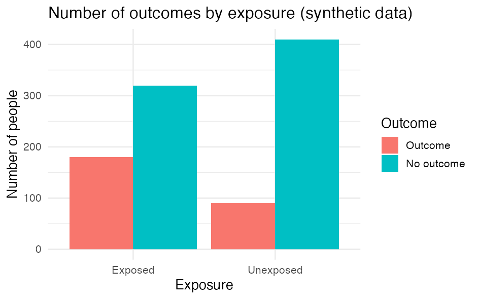

::: {.callout-warning}
**Under development.** This page shows a minimal, verified `ggplot2` example. More figure types are coming.
:::

Figures in R are often made with [`ggplot2`](https://ggplot2.tidyverse.org/). The key point on DST is that **a figure is data**: it must be **aggregated** before it can go through output control. A scatterplot with one point per person will never pass - show counts, proportions, rates or curves instead.

::: {.callout-note}
The code examples use generic path and variable names. Adapt them to your project. `ggplot2` must be installed in your R environment on DST.
:::

---

## Example

Build the figure from your dataset. Here we count the number of people per group and draw a bar chart.

```r
library(ggplot2)                       # ggplot(), geom_*, ggsave()
library(dplyr)                         # %>% and count()

df <- readRDS("path/to/analysis.rds")  # analysis-ready dataset

# Aggregate FIRST - the figure must show numbers, not individuals
counts <- df %>%
  count(exposure, outcome)             # number of people per combination of the two variables

p <- ggplot(counts, aes(x = exposure, y = n, fill = outcome)) +  # map columns to axes/colour
  geom_col(position = "dodge") +       # bars from the counted numbers, side by side per group
  labs(                                # all text on the figure:
    title = "Number of outcomes by exposure",                 # title
    x = "Exposure", y = "Number of people", fill = "Outcome"  # x-axis, y-axis, legend
  ) +
  theme_minimal()                      # clean, light look

p                                      # print the figure (show it in the Plots pane)
```

With synthetic numbers the figure looks like this:



The key parts:

- `aes()` maps columns to the figure's axes (`x`, `y`) and e.g. `fill` (colour).
- `geom_col()` draws bars from values you have counted yourself (unlike `geom_bar()`, which counts rows for you).
- `labs()` sets the title and axis/legend text; `theme_minimal()` gives a clean look.

## Customise the look

A figure is built up **layer by layer** with `+`: you start with `ggplot(...)` and add a new line for each thing you want to change. What a function should control, you write **inside its parentheses** `()` as an argument, e.g. `labs(title = "...")`.

Because we saved the figure in the object `p` in the code block above, you can build on it with `+`: you write **only what you want to add or change** - not the whole code again. (This requires that you have run the first code block, so `p` exists in your session.)

```r
p +                                                       # the figure from before
  labs(                                                   # new text (overrides what p already has):
    title = "Number of people per group",                 #   new title
    x = "Group", y = "Count", fill = "Outcome") +         #   x-axis, y-axis, legend
  scale_fill_manual(values = c("#4C72B0", "#DD8452")) +   # pick the bar colours yourself
  theme_minimal(base_size = 14) +                         # clean theme, slightly larger text
  theme(legend.position = "bottom")                       # move the legend to the bottom
```

Each line is one layer, and the order does not matter. A few typical moves:

- **Colour by a variable** goes inside `aes()` (e.g. `fill = outcome` as in the example at the top of the page); you then control the colours with `scale_fill_manual(values = ...)` or a ready-made palette (`scale_fill_brewer()`). If you instead want **one fixed colour** for all bars, write `fill = "steelblue"` inside `geom_col()`, i.e. *outside* `aes()`.
- **Axes:** `scale_y_continuous(...)` or `lims(y = c(0, 100))` control breaks and min/max.
- **Layout:** `coord_flip()` makes the bars horizontal (good for many categories); `facet_wrap(~ variable)` makes one panel per group.

Each function has many more arguments - look them up with e.g. `?labs` or `?scale_fill_manual`.

## Save the figure

`ggsave()` writes the most recent (or a named) figure to a file you can send to output control.

```r
ggsave("figure1.png", plot = p,        # save the figure p to a file
       width = 16, height = 10, units = "cm",  # physical size
       dpi = 300)                       # resolution (300 = print quality)
```

- `width` / `height` + `units` (`"cm"`, `"mm"`, `"in"` or `"px"`) set the physical size; `dpi = 300` is a good resolution for print.
- Choose `.png` (raster) or `.pdf` (vector, scales crisply) depending on the journal's requirements.

## Output control applies to figures too

A figure contains data. Always aggregate, and avoid showing groups with few people: a bar or point covering very few individuals can identify them. Show no individual-level points.

::: {.callout-note}
Remember: anything leaving DST must go through **output control** - no small cells, only aggregated results. See [Phase 14 - Export and repatriation](14_eksport-hjemsendelse.qmd).
:::


::: {.callout-tip}
## Further information

Further depth in *The Epidemiologist R Handbook*:

- [ggplot basics](https://www.epirhandbook.com/en/new_pages/ggplot_basics.html)
- [ggplot tips](https://www.epirhandbook.com/en/new_pages/ggplot_tips.html)
:::
