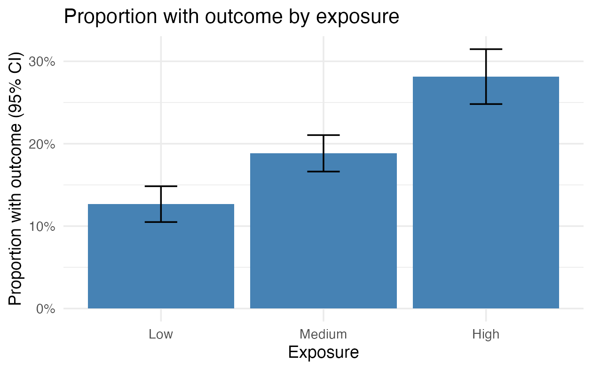
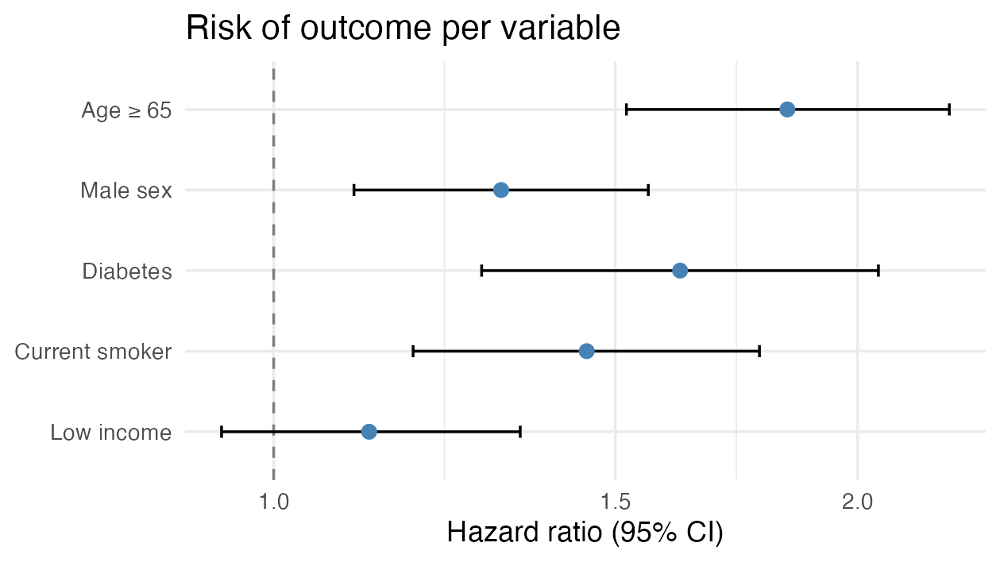

::: {.callout-warning}
**Under development.** This page shows a few `ggplot2` examples. More figure types are coming.
:::

Figures in R are often made with [`ggplot2`](https://ggplot2.tidyverse.org/). The key point on DST is that **a figure is data**: it must be **aggregated** before it can go through output control. A scatterplot with one point per person will never pass - show counts, proportions, rates or curves instead.

::: {.callout-note}
The code examples use generic path and variable names. Adapt them to your project. `ggplot2` must be installed in your R environment on DST.
:::

---

## Example

Build the figure from your dataset. Here we count the number of people per group and draw a bar chart.

<details>
<summary>Show the code: build the bar chart</summary>

```r
library(ggplot2)                       # ggplot(), geom_*, ggsave()
library(dplyr)                         # %>% and count()

df <- readRDS("path/to/analysis.rds")  # analysis-ready dataset

# Aggregate FIRST - the figure must show numbers, not individuals
counts <- df %>%
  count(exposure, outcome)             # number of people per combination of the two variables

p <- ggplot(counts, aes(x = exposure, y = n, fill = outcome)) +  # map columns to axes/colour
  geom_col(position = "dodge") +       # bars from the counted numbers, side by side per group
  labs(                                # all text on the figure:
    title = "Number of outcomes by exposure",                 # title
    x = "Exposure", y = "Number of people", fill = "Outcome"  # x-axis, y-axis, legend
  ) +
  theme_minimal()                      # clean, light look

p                                      # print the figure (show it in the Plots pane)
```

</details>

With simulated numbers the figure looks like this:


The key parts:

- `aes()` maps columns to the figure's axes (`x`, `y`) and e.g. `fill` (colour).
- `geom_col()` draws bars from values you have counted yourself (unlike `geom_bar()`, which counts rows for you).
- `labs()` sets the title and axis/legend text; `theme_minimal()` gives a clean look.

## Customise the look

A figure is built up **layer by layer** with `+`: you start with `ggplot(...)` and add a new line for each thing you want to change. What a function should control, you write **inside its parentheses** `()` as an argument, e.g. `labs(title = "...")`.

Because we saved the figure in the object `p` in the code block above, you can build on it with `+`: you write **only what you want to add or change** - not the whole code again. (This requires that you have run the first code block, so `p` exists in your session.)

<details>
<summary>Show the code: customise the look</summary>

```r
p +                                                       # the figure from before
  labs(                                                   # new text (overrides what p already has):
    title = "Number of people per group",                 #   new title
    x = "Group", y = "Count", fill = "Outcome") +         #   x-axis, y-axis, legend
  scale_fill_manual(values = c("#4C72B0", "#DD8452")) +   # pick the bar colours yourself
  theme_minimal(base_size = 14) +                         # clean theme, slightly larger text
  theme(legend.position = "bottom")                       # move the legend to the bottom
```

</details>

Each line is one layer, and the order does not matter. A few typical moves:

- **Colour by a variable** goes inside `aes()` (e.g. `fill = outcome` as in the example at the top of the page); you then control the colours with `scale_fill_manual(values = ...)` or a ready-made palette (`scale_fill_brewer()`). If you instead want **one fixed colour** for all bars, write `fill = "steelblue"` inside `geom_col()`, i.e. *outside* `aes()`.
- **Axes:** `scale_y_continuous(...)` or `lims(y = c(0, 100))` control breaks and min/max.
- **Layout:** `coord_flip()` makes the bars horizontal (good for many categories); `facet_wrap(~ variable)` makes one panel per group.

Each function has many more arguments - look them up with e.g. `?labs` or `?scale_fill_manual`.

## Figure with error bars (proportion and 95% CI)

The bar chart above shows raw counts. In registry work you will often rather show a **proportion or rate with a confidence interval**, so the figure also conveys the uncertainty. Error bars (`geom_errorbar()`) draw the interval on top of each bar or point.

Aggregate first again: one row per group with count, proportion and interval. Here we assume `outcome` is coded 0/1.

<details>
<summary>Show the code: proportion with error bars</summary>

```r
library(ggplot2)                       # ggplot(), geom_col(), geom_errorbar()
library(dplyr)                         # %>%, group_by(), summarise()

df <- readRDS("path/to/analysis.rds")  # analysis-ready dataset; outcome is 0/1

# Aggregate to one row per group: count, proportion with outcome and a 95% CI
props <- df %>%
  group_by(exposure) %>%                           # one group per exposure level
  summarise(
    n    = n(),                                    # number of people in the group
    x    = sum(outcome),                           # number with outcome (outcome coded 0/1)
    prop = x / n,                                  # proportion with outcome
    se   = sqrt(prop * (1 - prop) / n),            # standard error of the proportion
    .groups = "drop"
  ) %>%
  mutate(
    lower = prop - 1.96 * se,                      # lower bound of the 95% CI
    upper = prop + 1.96 * se                       # upper bound of the 95% CI
  )

p2 <- ggplot(props, aes(x = exposure, y = prop)) +        # proportion on the y-axis
  geom_col(fill = "steelblue") +                          # bar for the proportion
  geom_errorbar(aes(ymin = lower, ymax = upper),          # error bars = 95% CI
                width = 0.2) +                            # width of the "cap" on the bar
  scale_y_continuous(labels = scales::percent) +          # show the y-axis as percentages
  labs(
    title = "Proportion with outcome by exposure",
    x = "Exposure", y = "Proportion with outcome (95% CI)"
  ) +
  theme_minimal()

p2                                     # print the figure
```

</details>

With simulated numbers the figure looks like this:



The key parts:

- `geom_errorbar()` needs `ymin` and `ymax`; we computed them as `prop ± 1.96 · se` and put them in the dataset beforehand.
- The interval here is a simple **Wald interval**. It is fine for the large groups output control requires anyway, but becomes unreliable with few people or proportions close to 0 or 100 %. Use a better interval then, e.g. `prop.test()` or the `binom` package.
- **Same pattern for means:** to show a mean of a continuous variable per group (e.g. age at index), replace `prop` with `mean(variable)` and `se` with `sd(variable) / sqrt(n)`. The rest of the figure is the same.

## Forest plot (estimates with 95% CI)

A **forest plot** shows several effect estimates (hazard ratios or odds ratios) side by side with their confidence intervals and a vertical reference line at 1 (no effect). It is the standard way to present a regression model or a subgroup analysis, and it is output-control-safe because it shows only estimates and intervals, not individuals.

The typical workflow: pull the estimates out of a fitted model with `broom::tidy()` and plot them.

<details>
<summary>Show the code: forest plot from a model</summary>

```r
library(broom)                         # tidy() - model results as a tidy table
library(ggplot2)                       # the figure
library(dplyr)                         # %>%

# `model` is a fitted regression model, e.g. coxph() (survival) or glm() (logistic)
est <- tidy(model, conf.int = TRUE, exponentiate = TRUE) %>%  # exponentiate: log scale -> HR/OR
  filter(term != "(Intercept)") %>%                           # drop the intercept
  mutate(term = factor(term, levels = rev(term)))             # keep the order, first on top

ggplot(est, aes(x = estimate, y = term)) +
  geom_vline(xintercept = 1, linetype = "dashed", colour = "grey50") +    # 1 = no effect
  geom_errorbarh(aes(xmin = conf.low, xmax = conf.high), height = 0.15) +  # 95% CI
  geom_point(size = 2.6, colour = "steelblue") +                          # the estimate itself
  scale_x_log10() +                                                       # HR/OR read on a log scale
  labs(x = "Hazard ratio (95% CI)", y = NULL,
       title = "Risk of outcome per variable") +
  theme_minimal()
```

</details>

With simulated numbers the figure looks like this:



The key parts:

- `tidy(..., exponentiate = TRUE)` converts the coefficients from the log scale to **HR/OR**; `conf.int = TRUE` gives `conf.low`/`conf.high` (95% CI).
- The **reference line at 1** is "no effect": if the interval crosses 1, the estimate is not statistically clear (here e.g. *Low income*).
- `scale_x_log10()` puts e.g. HR 0.5 and HR 2 equally far from 1 - which is how ratios should be read.
- Control the **order** with `factor(term, levels = ...)`; without it ggplot sorts alphabetically.
- Estimates and CIs are aggregated numbers, so a forest plot passes output control easily.

## Save the figure

`ggsave()` writes the most recent (or a named) figure to a file you can send to output control.

<details>
<summary>Show the code: save the figure</summary>

```r
ggsave("figure1.png", plot = p,        # save the figure p to a file
       width = 16, height = 10, units = "cm",  # physical size
       dpi = 300)                       # resolution (300 = print quality)
```

</details>

- `width` / `height` + `units` (`"cm"`, `"mm"`, `"in"` or `"px"`) set the physical size; `dpi = 300` is a good resolution for print.
- Choose `.png` (raster) or `.pdf` (vector, scales crisply) depending on the journal's requirements.

## Output control applies to figures too

A figure contains data. Always aggregate, and avoid showing groups with few people: a bar or point covering very few individuals can identify them. Show no individual-level points.

::: {.callout-note}
Remember: anything leaving DST must go through **output control** - no small cells, only aggregated results. See [Phase 14 - Export and repatriation](14_eksport-hjemsendelse.qmd).
:::


::: {.callout-tip}
## Further information

Further depth in *The Epidemiologist R Handbook*:

- [ggplot basics](https://www.epirhandbook.com/en/new_pages/ggplot_basics.html)
- [ggplot tips](https://www.epirhandbook.com/en/new_pages/ggplot_tips.html)
:::
