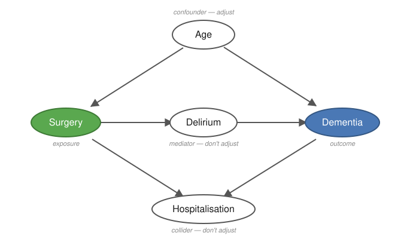

Register-based research does not start in R. It starts with pen and paper. This
page guides you through the things you should have in place before writing a
single line of code.

::: {.callout-tip}
**In short:** Settle four things on paper before you code - a precise research
question, your data model (which registers cover exposure, outcome and
covariates), your covariates chosen with a DAG, and your comparison cohort.
:::

## What type of study are you doing? {#study-type}

Almost all register-based research is **observational and analytical**: you
observe what has already happened, without intervening. Registers record the
past, so you cannot randomise anyone. The two classic analytical designs are
**case-control** and **cohort**; [Phase 10](build-study-population.qmd) shows how
to build a matched cohort study.

<details>
<summary>Case-control or cohort - what is the difference?</summary>

The two analytical designs differ in **which end you start from**:

| | Cohort | Case-control |
|---|---|---|
| **Starting point** | Exposure | Outcome |
| **Direction** | Follows forward: exposed → outcome | Looks back: case → prior exposure |
| **Best when** | Exposure is rare; multiple outcomes | Outcome is rare; single outcome |
| **Effect measure** | Incidence, relative risk (RR), hazard ratio | Odds ratio (OR) |
| **In registers** | Define exposed group + comparator cohort, follow forward | Find all cases, select controls, look back at exposure |

**Cohort** follows persons forward in time from the index date and measures how many develop the outcome - which is why you can compute incidence and risk. Well suited when you have multiple outcomes (cf. the `alle_dx` approach in [Extract from LPR](extract-from-lpr.qmd)).

**Case-control** starts from those who already *have* the outcome and matches them with controls without it - efficient for rare outcomes, but cannot compute absolute risk.

With register data you can do both, because the entire population's history is available. [Phase 10](build-study-population.qmd) shows a **matched cohort study** step by step.

</details>

## Key concepts {#key-concepts}

Before planning a study it is worth knowing these terms - they are used
throughout the guide.

**Cohort** A group of people followed over time because they share a particular
characteristic at a particular point in time. Example: all patients who
underwent bariatric surgery in the period 2010--2020.

**Index date** The start date of follow-up - the point from which you begin
counting. For operated patients this is typically the date of surgery. For
matched comparators the same date as the matched operated patient is assigned.

**Exposure** The factor whose effect you are investigating - e.g. a surgery, a
medication, or a diagnosis.

**Outcome** What you are measuring - e.g. onset of a disease, a hospitalisation,
or death.

**Covariates** Variables you include to account for confounding - factors that
affect both exposure and outcome. Examples: age, sex, comorbidity, socioeconomic
status.

## 1. What do I want to investigate?

Formulate your research question precisely before looking at any data. A vague
question produces a messy dataset. A precise question produces a clear plan.

Ask yourself:

  | Question                                  | Example                                              |
  | ----------------------------------------- | ---------------------------------------------------- |
  | Who is my population?                     | All adults with T2D in Denmark, 2010–2020            |
  | What is my exposure?                      | Bariatric surgery                                    |
  | What is my outcome?                       | Dementia                                             |
  | When does follow-up start?                | Date of surgery (index date)                         |
  | When does it end?                         | Diagnosis, death, emigration, or end of study period |
  | Which confounders should be adjusted for? | Age, sex, comorbidity, SES                           |

Make sure follow-up starts at the same moment eligibility and exposure are
decided. When those drift apart you get [immortal time
bias](dst-pitfalls.qmd#immortal-time-bias).

## 2. Which registers cover what?

Before mapping your data model it is useful to know which registers exist.

  | What do you need to find?          | Register                                      |
  | ---------------------------------- | --------------------------------------------- |
  | Demographics (age, sex, residence) | BEF - Population Register                     |
  | Hospital diagnoses and contacts    | LPR - National Patient Register (LPR2 + LPR3) |
  | Dispensed prescriptions            | LMDB - Prescription Register                  |
  | Date of death (for censoring)      | DOD - Death Register                          |
  | Emigration (for censoring)         | VNDS - Migration Register                     |
  | Education                          | UDDA - Education Register                     |
  | Income                             | FAIK - Family Income Register                 |
  | Employment                         | AKM - Labour Classification Module            |

A complete description of all registers with column names and join keys is in
[Overview of registers →](register-reference.qmd)

## 3. Choose your covariates using a DAG {#covariates-dag}

Which variables should you adjust for? The answer is not "as many as possible".
Adjusting for the wrong variables can **introduce** bias rather than remove it.

A **DAG** (directed acyclic graph - a causal diagram) is a drawing of your
assumptions about how exposure, outcome and other variables relate to each
other. It makes your assumptions explicit and helps you choose the right set of
covariates.

Rules of thumb:

- **Adjust for confounders:** variables that affect both exposure and outcome
  (e.g. age, comorbidity).
- **Do NOT adjust for mediators:** variables that lie *on* the causal pathway
  between exposure and outcome (this removes part of the effect you want to
  measure).
- **Do NOT adjust for colliders:** common effects of two variables (this opens a
  spurious association).

You do not have to work the rules out by hand.
[dagitty.net](https://dagitty.net/) takes your drawing and returns the **minimal
adjustment set**: the smallest group of variables that removes the confounding
without opening a new bias through a collider.

<details>
<summary>Example: surgery and dementia - a DAG with confounder, mediator and collider</summary>

A concrete example: does **surgery** affect the risk of **dementia**?

{#fig-dag fig-alt="Causal diagram with five variables: surgery (exposure), dementia (outcome), age (confounder), delirium (mediator) and hospitalisation (collider)." width="92%"}

- **Age** is a *confounder* - it affects both the probability of surgery and of dementia. **Adjust for it.**
- **Delirium** (post-operative delirium) is a *mediator* - it lies on the path surgery → delirium → dementia. **Do not adjust** - that removes part of the effect you want to measure.
- **Hospitalisation** is a *collider* - both surgery and dementia lead to hospitalisation. **Do not adjust** - it opens a spurious association.

You can paste the model straight into [dagitty.net](https://dagitty.net/dags.html) and have the minimal adjustment set computed:

```
dag {
  Age            [pos="0,-1"]
  Surgery        [exposure, pos="-1.5,0"]
  Delirium       [pos="0,0"]
  Dementia       [outcome,  pos="1.5,0"]
  Hospitalisation [pos="0,1"]
  Age      -> Surgery
  Age      -> Dementia
  Surgery  -> Delirium
  Delirium -> Dementia
  Surgery  -> Hospitalisation
  Dementia -> Hospitalisation
}
```

For this DAG the minimal adjustment set is **{Age}** - you only need to adjust for age.

</details>

::: {.callout-tip}
**Tools**

- [dagitty.net](https://dagitty.net/): draw your diagram in the browser; it
  automatically calculates the minimal set of covariates to adjust for.
- [Causal Diagrams: Draw Your Assumptions Before Your
  Conclusions](https://pll.harvard.edu/course/causal-diagrams-draw-your-assumptions-your-conclusions):
  free HarvardX course by Miguel Hernán on exactly this.
- Background: [Hernán & Robins, *Causal Inference: What
  If*](https://miguelhernan.org/whatifbook) (free PDF) - also in [Learning
  resources](learning-resources.qmd).
:::

## 4. The comparator cohort {#comparator-cohort}

Many studies compare an exposed group with a **comparator cohort**. How you
build it is a design decision to be made on paper - before writing code. At this
stage you only need to settle four things:

- **Who is an appropriate comparator?** An **active comparator** (unexposed
  people with the same indication - reduces confounding by indication), or a
  matched **background population** (maximal contrast).
- **What decides the comparator's index date**, since the exposure does not give
  them one.
- **Which variables you match on, and at what ratio** (e.g. age, sex and
  calendar year, 1:5).
- **What happens if a comparator becomes exposed later.**

→ Each of these, plus eligibility at index, the shared exclusions and the
immortal-time trap, is worked through in [Phase 10 - Build your study
population](build-study-population.qmd) and [Comparison
cohort](comparison-cohort.qmd).

## 5. Get an overview - pen and paper

Before opening R, answer these questions in writing:

1. **Which variables do I need?** (patient information - age, sex, diagnoses
   etc. - and for which years)
2. **Which registers contain this information?** (LPR, BEF, LMDB, ...)
3. **In what order should data be assembled?** (define population → extract
   outcome → extract covariates)

A solid overview on paper saves many hours of debugging in code.

<details>
<summary>Example: overview for a dementia study</summary>

```
Population:   Adults who have undergone bariatric surgery (identified via the Danish Obesity
              Treatment Database - DBSO), 2010–2024
              Matched comparators from the Population Register (BEF)

Outcome:      First dementia diagnosis (LPR - ICD-10: F00–F03, G30–G31)
              Date: first contact with a dementia code after the surgery date

Covariates:   Age and sex (BEF)
              Comorbidity (LPR - 5-year lookback, i.e. diagnoses in the 5 years before index date)
              Education (UDDA)
              Income (FAIK via BEF familie_id)
              Employment (AKM)

Censoring:    Death (DOD)
              Emigration (VNDS)
              End of study period (31 Dec 2024)
```

</details>

## 6. Write an analysis plan

An analysis plan is a document you write **before** looking at your data. It
forces you to commit to design, statistics and variables before results can
colour your decisions.

**Use the STROBE checklist** as a skeleton: [STROBE Statement - checklists
→](https://www.strobe-statement.org/checklists/)

For register-based studies, **RECORD** extends STROBE with items on routinely
collected data, and **RECORD-PE** covers pharmacoepidemiology specifically:
[RECORD-PE (EQUATOR Network)
→](https://www.equator-network.org/reporting-guidelines/record-pe/)

**Pre-register your analysis plan on e.g. OSF** - this is good scientific
practice and required by many journals: [Open Science Framework - registration
templates](https://help.osf.io/article/330-welcome-to-registrations)

::: {.callout-note}
**Power and sample size.** Even large registers have limited **power** (the
ability to detect an effect that is really there) for **rare outcomes** or small
subgroups. Already in the plan, consider the **smallest effect you could
meaningfully detect** with your expected number of events. The `pwr` package
does simple power/sample-size calculations; for survival and rate designs it is
often the number of **events** (not the number of people) that drives your
power.
:::

## 7. Next steps

Once you have your overview in place:

- **New to R?** → [Phase 2 - R: the bare essentials](r-intro.qmd)
- **Ready for the DST server?** → [Phase 3 - Log in to DST](log-in-dst.qmd)
- **Working on DARTER / project 708421?** → Read this first: [DARTER - overview
  and pipeline](darter-index.qmd)
